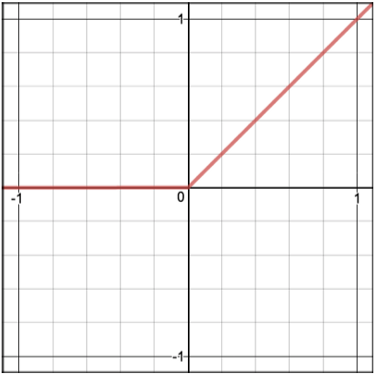

.. _activation_functions:

====================
Activation Functions
====================

.. contents:: :local:

ELU
===

Be the first to `contribute! <https://github.com/bfortuner/ml-cheatsheet>`__

LeakyReLU
=========

Be the first to `contribute! <https://github.com/bfortuner/ml-cheatsheet>`__

.. _activation_relu:

ReLU
====

A recent invention which stands for Rectified Linear Units. The formula is deceptively simple: :math:`max(0,z)`. Despite its name and appearance, it’s not linear and provides the same benefits as Sigmoid but with better performance.

.. math::

  R(z) = \begin{Bmatrix}
  z & z > 0 \\
  0 & otherwise \\
  \end{Bmatrix}\\

.. literalinclude:: ../code/activation_functions.py
    :language: python
    :pyobject: relu

**Derivative**

The derivative of relu...

.. math::

  R'(z) = \begin{Bmatrix}
  1 & z>0 \\
  0 & z<0 \\
  \end{Bmatrix}

.. literalinclude:: ../code/activation_functions.py
    :language: python
    :pyobject: relu_prime

.. _activation_sigmoid:

Sigmoid
=======

.. image:: images/sigmoid.png
    :align: center

Sigmoid takes a real value as input and outputs another value between 0 and 1. It’s easy to work with and has all the nice properties of activation functions: it’s non-linear, continuously differentiable, monotonic, and has a fixed output range.

.. math::

  S(z) = \frac{1} {1 + e^{-z}}

.. literalinclude:: ../code/activation_functions.py
    :language: python
    :pyobject: sigmoid

**Derivative**

.. math::

  S'(z) = S(z) * (1 - S(z))

.. literalinclude:: ../code/activation_functions.py
    :language: python
    :pyobject: sigmoid_prime

Softmax
=======

Be the first to `contribute! <https://github.com/bfortuner/ml-cheatsheet>`__

Tanh
====

Be the first to `contribute! <https://github.com/bfortuner/ml-cheatsheet>`__

.. rubric:: References

.. [1] Example
