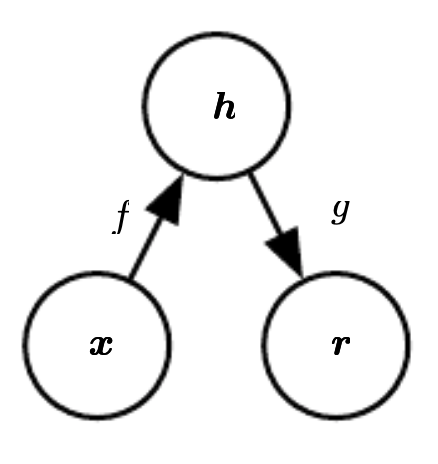
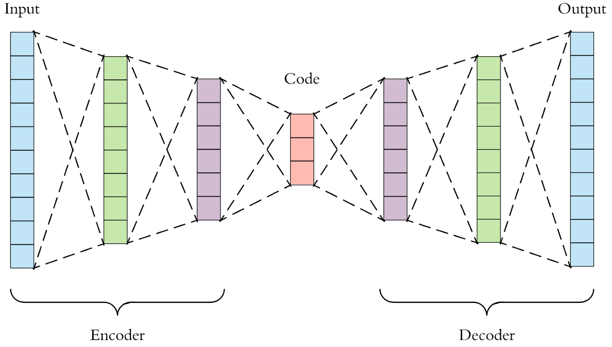

.. _architectures:

=============
Architectures
=============

.. contents:: :local:

Autoencoder
===========

An autoencoder is a type of feedforward neural network that attempts to copy
its input to its output. Internally, it has a hidden layer, **h**, that
describes a **code**, used to represent the input. The network consists of
two parts:

* An *encoder* function: :math:`h = f(x)`.
* A *decoder* function, that produces a reconstruction: :math:`r = g(h)`.

The figure below shows the presented architecture.

       Source [#autoenc]_

The autoencoder compresses the input into a lower-dimensional code, and then
it reconstructs the output from this representation. The code is a compact
"summary", or "compression", of the input, and it is also called the
*latent-space
representation*.

If an autoencoder simply learned to set :math:`g(f(x))=x` everywhere, then it would
not be very
useful; instead, autoencoders are designed to be unable to learn to copy
perfectly. They are restricted in ways that allow them to copy only
approximately, and to copy only input that resembles the training data.
Because the model is forced to prioritize which aspects of the input to copy,
it learns useful properties of the data.

In order to build an autoencoder, three things are needed: an encoding
method, a decoding method, and a loss function to compare the output with the
target.

Both the encoder and the decoder are fully-connected feedforward neural
networks. The code is a single layer of an artificial neural network, with
the dimensionality of our choice. The number of nodes in the code layer (the
*code size*) is a *hyperparameter* to be set before training the autoencoder.

The figure below shows the autoencoder architecture. First, the input passes
through the encoder, which is a fully-connected neural network, in order to
produce the code. The decoder, which has the similar neural network
structure, then produces the output by using the code only. The aim is to
get an output identical to the input.

      Source [#2a]_

Traditionally, autoencoders were used for dimensionality reduction or feature
learning. More recently, theoretical connections between autoencoders and
latent variable models have brought autoencoders to the forefront of
generative modeling.
As a compression method, autoencoders do not perform better than their
alternatives. And the fact that autoencoders are data-specific makes them
impractical as a general technique.

In general, autoencoders have three common use cases:

* **Data denoising:** It should be noted that denoising autoencoders are not
  meant to automatically denoise an image, instead they were invented to help
  the hidden layers of the autoencoder learn more robust filters, and reduce
  the the risk of overfitting.
* **Dimensionality reduction:** Visualizing high-dimensional data is
  challenging. t-SNE [#tsne]_ is the most commonly used method, but struggles
  with large number of dimensions (typically above 32).
  Therefore, autoencoders can be used as a preprocessing step to reduce the
  dimensionality, and this compressed representation is used by t-SNE to
  visualize the data in 2D space.
* **Variational Autoencoders (VAE):** this is a more modern and complex
  use-case of autoencoders. VAE learns the parameters of the probability
  distribution modeling the input data, instead of learning an arbitrary
  function in the case of vanilla autoencoders. By sampling points from this
  distribution we can also use the VAE as a generative model [#vae]_.

.. rubric:: Model

An example implementation in PyTorch.

.. literalinclude:: ../code/autoencoder.py
      :pyobject: Autoencoder

.. rubric:: Training

.. literalinclude:: ../code/autoencoder.py
      :pyobject: train

.. rubric:: Further reading

- `Convolutional Autoencoders <https://pgaleone.eu/neural-networks/2016/11/24/convolutional-autoencoders/>`_
- `Deep Learning Book <http://www.deeplearningbook.org/contents/autoencoders.html>`_

CNN
===

The *convolutional neural network*, or *CNN*, is a feed-forward neural network
which has at least one convolutional layer. This type of deep neural network
is used for processing structured arrays of data. It is distinguished from other
neural networks by its superior performance with speech, audio, and
especially, image data. For the latter data type, CNNs are commonly employed
in computer vision tasks, like image classification, since they are
especially good at finding out patterns from the input images, such as lines,
circles, or more complex objects, e.g., human faces.

Convolutional neural networks comprise many convolutional layers, stacked one
on top of the other, in a sequence. The sequential architecture of CNNs
allows them to learn hierarchical features. Every layer can recognize shapes,
and the deeper the network goes, the more complex are the shapes which can be
recognized. The design of convolutional layers in a CNN reflects the
structure of the human visual cortex. In fact, our visual cortex is similarly
made of different layers, which process an image in our sight by sequentially identifying more and more complex features.

The CNN architecture is made up of three main distinct layers:

#. Convolutional layer
#. Pooling layer
#. Fully-connected (FC) layer

.. figure:: images/cnn.jpg
      :align: center
      :width: 600 px

      **Overview of CNN architecture.** The architecture of CNNs follows this
      structure, but with a greater number of layers for each layer’s type. The
      convolutional and pooling layers are layers peculiar to CNNs, while the
      fully-connected layer, activation function and output layer, are also
      present in regular feed-forward neural networks. Source: [2]

When working with image data, the CNN architecture accepts as input a 3D
volume, or a 1D vector depending if the image data is in RGB format, for the
first case, or in grayscale format, for the latter. Then it transforms the input
through different equations, and it outputs a class. The convolutional layer
is the first layer of the convolutional neural network. While this first
layer can be followed by more convolutional layers, or pooling layers, the
fully-connected layer remains the last layer of the network, which outputs
the result. At every subsequent convolutional layer, the CNN increases its
complexity, and it can identify greater portions in the image. In the first
layers, the algorithm can recognize simpler features such as color or edges.
Deeper in the network, it becomes able to identify both larger objects in the
image and more complex ones. In the last layers, before the image reaches the
final FC layer, the CNN identifies the full object in the image.

.. rubric:: Model

An example implementation of a CNN in PyTorch.

.. literalinclude:: ../code/cnn.py
      :pyobject: CNN

.. rubric:: Training

.. literalinclude:: ../code/cnn.py
      :pyobject: train

.. rubric:: Further reading

- `CS231 Convolutional Networks <http://cs231n.github.io/convolutional-networks>`_
- `Deep Learning Book <http://www.deeplearningbook.org/contents/convnets.html>`_

GAN
===
A Generative Adversarial Network (GAN) is a type of network which creates novel tensors (often images, voices, etc.). The generative portion of the architecture competes with the discriminator part of the architecture in a zero-sum game. The goal of the generative network is to create novel tensors which the adversarial network attempts to classify as real or fake. The goal of the generative network is generate tensors where the discriminator network determines that the tensor has a 50% chance of being fake and a 50% chance of being real.

Figure from [3].

.. image:: images/gan.png
      :align: center

.. rubric:: Model

An example implementation in PyTorch.

.. rubric:: Generator

.. literalinclude:: ../code/gan.py
      :pyobject: Generator
      
.. rubric:: Discriminator

.. literalinclude:: ../code/gan.py
      :pyobject: Discriminator

.. rubric:: Training

.. literalinclude:: ../code/gan.py
      :pyobject: train

.. rubric:: Further reading

- `Generative Adversarial Networks <http://guertl.me/post/162759264070/generative-adversarial-networks>`_
- `Deep Learning Book <http://www.deeplearningbook.org/contents/generative_models.html>`_
- `PyTorch DCGAN Example <https://pytorch.org/tutorials/beginner/dcgan_faces_tutorial.html>`_
- `Original Paper <https://papers.nips.cc/paper/2014/file/5ca3e9b122f61f8f06494c97b1afccf3-Paper.pdf>`_

MLP
===

A Multi Layer Perceptron (MLP) is a neural network with only fully connected layers. Figure from [5].

.. image:: images/mlp.jpg
      :align: center

.. rubric:: Model

An example implementation on FMNIST dataset in PyTorch. `Full Code <https://github.com/bfortuner/ml-cheatsheet/blob/master/code/mlp.py>`__

1. The input to the network is a vector of size 28*28 i.e.(image from FashionMNIST dataset of dimension 28*28 pixels flattened to sigle dimension vector).

2. 2 fully connected hidden layers.

3. Output layer with 10 outputs.(10 classes)

.. literalinclude:: ../code/mlp.py
      :pyobject: MLP

.. rubric:: Training

.. literalinclude:: ../code/mlp.py
      :pyobject: train

.. rubric:: Evaluating

.. literalinclude:: ../code/mlp.py
      :pyobject: main

.. rubric:: Further reading

TODO

RNN
===

Description of RNN use case and basic architecture.

.. image:: images/rnn.png
      :align: center

.. rubric:: Model

.. literalinclude:: ../code/rnn.py
      :pyobject: RNN

.. rubric:: Training

In this example, our input is a list of last names, where each name is
a variable length array of one-hot encoded characters. Our target is is a list of
indices representing the class (language) of the name.

1. For each input name..
2. Initialize the hidden vector
3. Loop through the characters and predict the class
4. Pass the final character's prediction to the loss function
5. Backprop and update the weights

.. literalinclude:: ../code/rnn.py
      :pyobject: train

.. rubric:: Further reading

- `Jupyter notebook <https://github.com/bfortuner/ml-cheatsheet/blob/master/notebooks/rnn.ipynb>`_
- `Deep Learning Book <http://www.deeplearningbook.org/contents/rnn.html>`_

VAE
===

Autoencoders can encode an input image to a latent vector and decode it, but they can't generate novel images.
Variational Autoencoders (VAE) solve this problem by adding a constraint: the latent vector representation should model a unit gaussian distribution.
The Encoder returns the mean and variance of the learned gaussian. To generate a new image, we pass a new mean and variance to the Decoder.
In other words, we "sample a latent vector" from the gaussian and pass it to the Decoder.
It also improves network generalization and avoids memorization. Figure from [4].

.. image:: images/vae.png
      :align: center

.. rubric:: Loss Function

The VAE loss function combines reconstruction loss (e.g. Cross Entropy, MSE) with KL divergence.

.. literalinclude:: ../code/vae.py
      :pyobject: vae_loss

.. rubric:: Model

An example implementation in PyTorch of a Convolutional Variational Autoencoder.

.. literalinclude:: ../code/vae.py
      :pyobject: VAE

.. rubric:: Training

.. literalinclude:: ../code/vae.py
      :pyobject: train

.. rubric:: Further reading

- `Original Paper <https://arxiv.org/abs/1312.6114>`_
- `VAE Explained <http://kvfrans.com/variational-autoencoders-explained>`_
- `Deep Learning Book <http://www.deeplearningbook.org/contents/autoencoders.html>`_

.. rubric:: References

.. [1] https://hackernoon.com/autoencoders-deep-learning-bits-1-11731e200694
.. [2] https://iq.opengenus.org/basics-of-machine-learning-image-classification-techniques/
.. [3] http://guertl.me/post/162759264070/generative-adversarial-networks
.. [4] http://kvfrans.com/variational-autoencoders-explained

.. [#2a] `Applied Deep Learning - Part 3: Autoencoders
<https://towardsdatascience
.com/applied-deep-learning-part-3-autoencoders-1c083af4d798/>`__

.. [#autoenc] `Deep Learning Book - Autoencoders <https://www.deeplearningbook
.org/contents/autoencoders.html/>`__

.. [#tsne] `t-SNE <https://distill.pub/2016/misread-tsne/>`__

.. [#vae] `VAE <https://kvfrans.com/variational-autoencoders-explained/>`__