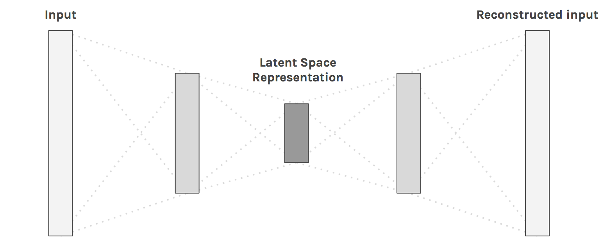
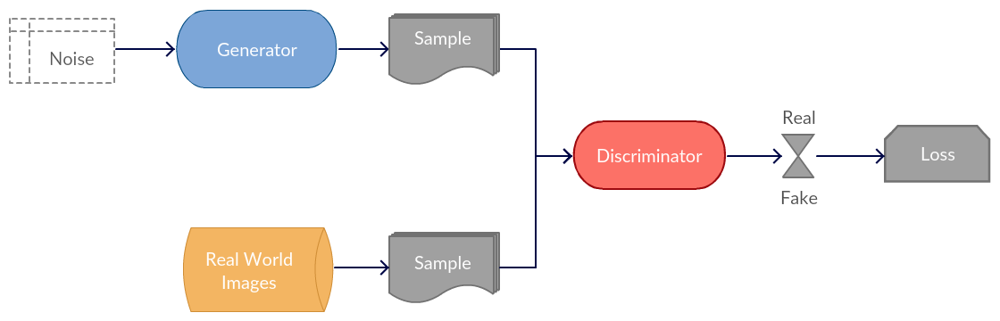
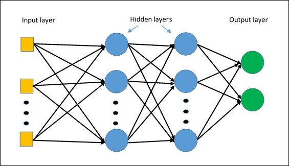
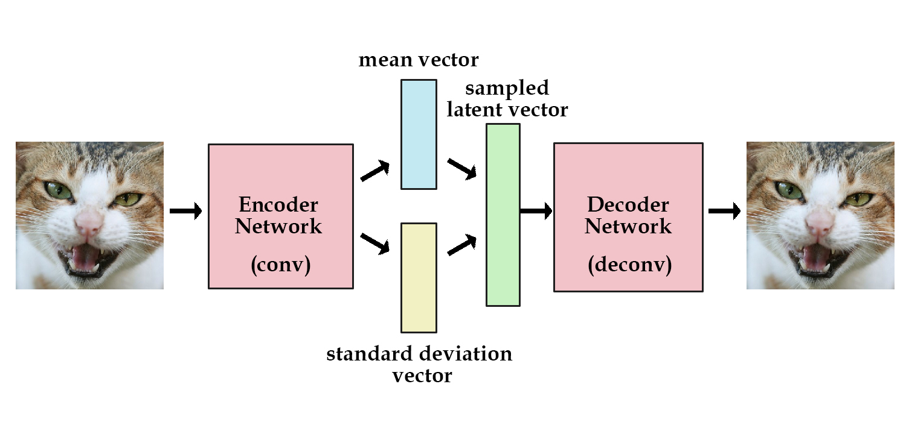

.. _architectures:

=============
Architectures
=============

.. contents:: :local:

Autoencoder
===========

TODO: Description of Autoencoder use case and basic architecture. Figure from [1].

.. rubric:: Model

An example implementation in PyTorch.

.. literalinclude:: ../code/autoencoder.py
      :pyobject: Autoencoder

.. rubric:: Training

.. literalinclude:: ../code/autoencoder.py
      :pyobject: train

.. rubric:: Further reading

- `Convolutional Autoencoders <https://pgaleone.eu/neural-networks/2016/11/24/convolutional-autoencoders/>`_
- `Deep Learning Book <http://www.deeplearningbook.org/contents/autoencoders.html>`_

CNN
===

TODO: Description of CNN use case and basic architecture. Figure from [2].

.. image:: images/cnn.jpeg
      :align: center

.. rubric:: Model

An example implementation in PyTorch.

.. literalinclude:: ../code/cnn.py
      :pyobject: CNN

.. rubric:: Training

.. literalinclude:: ../code/cnn.py
      :pyobject: train

.. rubric:: Further reading

- `CS231 Convolutional Networks <http://cs231n.github.io/convolutional-networks>`_
- `Deep Learning Book <http://www.deeplearningbook.org/contents/convnets.html>`_

GAN
===

TODO: Description of GAN use case and basic architecture. Figure from [3].

.. rubric:: Model

TODO: An example implementation in PyTorch.

.. rubric:: Training

TODO

.. rubric:: Further reading

- `Generative Adversarial Networks <http://guertl.me/post/162759264070/generative-adversarial-networks>`_
- `Deep Learning Book <http://www.deeplearningbook.org/contents/generative_models.html>`_

MLP
===

A Multi Layer Perceptron (MLP) is a neural network with only fully connected layers. Figure from [5].

.. rubric:: Model

An example implementation in PyTorch.

.. literalinclude:: ../code/mlp.py
      :pyobject: MLP

.. rubric:: Training

.. literalinclude:: ../code/mlp.py
      :pyobject: train

.. rubric:: Further reading

TODO

RNN
===

Description of RNN use case and basic architecture.

.. image:: images/rnn.png
      :align: center

.. rubric:: Model

.. literalinclude:: ../code/rnn.py
      :pyobject: RNN

.. rubric:: Training

In this example, our input is a list of last names, where each name is
a variable length array of one-hot encoded characters. Our target is is a list of
indices representing the class (language) of the name.

1. For each input name..
2. Initialize the hidden vector
3. Loop through the characters and predict the class
4. Pass the final character's prediction to the loss function
5. Backprop and update the weights

.. literalinclude:: ../code/rnn.py
      :pyobject: train

.. rubric:: Further reading

- `Jupyter notebook <https://github.com/bfortuner/ml-cheatsheet/blob/master/notebooks/rnn.ipynb>`_
- `Deep Learning Book <http://www.deeplearningbook.org/contents/rnn.html>`_

VAE
===

Autoencoders can encode an input image to a latent vector and decode it, but they can't generate novel images.
Variational Autoencoders (VAE) solve this problem by adding a constraint: the latent vector representation should model a unit gaussian distribution.
The Encoder returns the mean and variance of the learned gaussian. To generate a new image, we pass a new mean and variance to the Decoder.
In other words, we "sample a latent vector" from the gaussian and pass it to the Decoder.
It also improves network generalization and avoids memorization. Figure from [4].

.. rubric:: Loss Function

The VAE loss function combines reconstruction loss (e.g. Cross Entropy, MSE) with KL divergence.

.. literalinclude:: ../code/vae.py
      :pyobject: vae_loss

.. rubric:: Model

An example implementation in PyTorch of a Convolutional Variational Autoencoder.

.. literalinclude:: ../code/vae.py
      :pyobject: VAE

.. rubric:: Training

.. literalinclude:: ../code/vae.py
      :pyobject: train

.. rubric:: Further reading

- `Original Paper <https://arxiv.org/abs/1312.6114>`_
- `VAE Explained <http://kvfrans.com/variational-autoencoders-explained>`_
- `Deep Learning Book <http://www.deeplearningbook.org/contents/autoencoders.html>`_

.. rubric:: References

.. [1] https://hackernoon.com/autoencoders-deep-learning-bits-1-11731e200694
.. [2] http://cs231n.github.io/convolutional-networks
.. [3] http://guertl.me/post/162759264070/generative-adversarial-networks
.. [4] http://kvfrans.com/variational-autoencoders-explained
