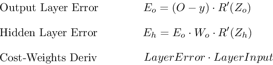

.. _backpropagation:

===============
Backpropagation
===============

.. contents:: :local:

The goals of backpropagation are straightforward: adjust each weight in the network in proportion to how much it contributes to overall error. If we iteratively reduce each weight's error, eventually we’ll have a series of weights the produce good predictions.

Chain rule refresher
====================

As seen above, foward propagation can be viewed as a long series of nested equations. If you think of feed forward this way, then backpropagation is merely an application the :ref:`chain_rule` to find the :ref:`derivative` of cost with respect to any variable in the nested equation. Given a forward propagation function:

.. math::

  f(x) = A(B(C(x)))

A, B, and C are activation functions at different layers. Using the chain rule we easily calculate the derivative of :math:`f(x)` with respect to :math:`x`:

.. math::

  f'(x) = f'(A) \cdot A'(B) \cdot B'(C) \cdot C'(x)

How about the derivative with respect to B? To find the derivative with respect to B you can pretend :math:`B(C(x))` is a constant, replace it with a placeholder variable B, and proceed to find the derivative normally with respect to B.

.. math::

  f'(B) = f'(A) \cdot A'(B)

This simple technique extends to any variable within a function and allows us to precisely pinpoint the exact impact each variable has on the total output.

Applying the chain rule
=======================

Let's use the chain rule to calculate the derivative of cost with respect to any weight in the network. The chain rule will help us identify how much each weight contributes to our overall error and the direction to update each weight to reduce our error. Here are the equations we need to make a prediction and calculate total error, or cost:

.. image:: images/backprop_ff_equations.png
    :align: center

Given a network consisting of a single neuron, total cost could be calculated as:

.. math::

  Cost = C(R(Z(X W)))

Using the chain rule we can easily find the derivative of Cost with respect to weight W.

.. math::

  C'(W) &= C'(R) \cdot R'(Z) \cdot Z'(W) \\
        &= (\hat{y} -y) \cdot R'(Z) \cdot X

Now that we have an equation to calculate the derivative of cost with respect to any weight, let's go back to our toy neural network example above

.. image:: images/simple_nn_diagram_zo_zh_defined.png
    :align: center

What is the derivative of cost with respect to :math:`W_o`?

.. math::

  C'(W_O) &= C'(\hat{y}) \cdot \hat{y}'(Z_O) \cdot Z_O'(W_O) \\
          &= (O - y) \cdot R'(Z_O) \cdot H

And how about with respect to :math:`W_h`? To find out we just keep going further back in our function applying the chain rule recursively until we get to the function that has the Wh term.

.. math::

  C'(W_h) &= C'(\hat{y}) \cdot O'(Z_o) \cdot Z_o'(H) \cdot H'(Z_h) \cdot Z_h'(W_h) \\
          &= (\hat{y} - y) \cdot R'(Z_o) \cdot W_o \cdot R'(Z_h) \cdot X

And just for fun, what if our network had 10 hidden layers. What is the derivative of cost for the first weight :math:`w_1`?

.. math::

  C'(w_1) = \frac{dC}{dO} \cdot \frac{dO}{dZ_{11}} \cdot \frac{dZ_{11}}{dH_{10}} \cdot \\ \frac{dH_{10}}{dZ_{10}} \cdot \frac{dZ_{10}}{dH_9} \cdot \frac{dH_9}{dZ_9} \cdot \frac{dZ_9}{dH_8} \cdot \frac{dH_8}{dZ_8} \cdot \frac{dZ_8}{dH_7} \cdot \frac{dH_7}{dZ_7} \cdot \\ \frac{dZ_7}{dH_6} \cdot \frac{dH_6}{dZ_6} \cdot \frac{dZ_6}{dH_5} \cdot \frac{dH_5}{dZ_5} \cdot \frac{dZ_5}{dH_4} \cdot \frac{dH_4}{dZ_4} \cdot \frac{dZ_4}{dH_3} \cdot \\ \frac{dH_3}{dZ_3} \cdot \frac{dZ_3}{dH_2} \cdot \frac{dH_2}{dZ_2} \cdot \frac{dZ_2}{dH_1} \cdot \frac{dH_1}{dZ_1} \cdot \frac{dZ_1}{dW_1}

See the pattern? The number of calculations required to compute cost derivatives increases as our network grows deeper. Notice also the redundancy in our derivative calculations. Each layer's cost derivative appends two new terms to the terms that have already been calculated by the layers above it. What if there was a way to save our work somehow and avoid these duplicate calculations?

Saving work with memoization
============================

Memoization is a computer science term which simply means: don’t recompute the same thing over and over. In memoization we store previously computed results to avoid recalculating the same function. It's handy for speeding up recursive functions of which backpropagation is one. Notice the pattern in the derivative equations below.

.. image:: images/memoization.png
    :align: center

Each of these layers is recomputing the same derivatives! Instead of writing out long derivative equations for every weight, we can use memoization to save our work as we backprop error through the network. To do this, we define 3 equations (below), which together encapsulate all the calculations needed for backpropagation. The math is the same, but the equations provide a nice shorthand we can use to track which calculations we've already performed and save our work as we move backwards through the network.

.. image:: images/backprop_3_equations.png
    :align: center

We first calculate the output layer error and pass the result to the hidden layer before it. After calculating the hidden layer error, we pass its error value back to the previous hidden layer before it. And so on and so forth. As we move back through the network we apply the 3rd formula at every layer to calculate the derivative of cost with respect that layer's weights. This resulting derivative tells us in which direction to adjust our weights to reduce overall cost.

.. note::

  The term *layer error* refers to the derivative of cost with respect to a layer's *input*. It answers the question: how does the cost function output change when the input to that layer changes?

.. rubric:: Output layer error

To calculate output layer error we need to find the derivative of cost with respect to the output layer input, :math:`Z_o`. It answers the question — how are the final layer's weights impacting overall error in the network? The derivative is then:

.. math::

  C'(Z_o) = (\hat{y} - y) \cdot R'(Z_o)

To simplify notation, ml practitioners typically replace the :math:`(\hat{y}-y) * R'(Zo)` sequence with the term :math:`E_o`. So our formula for output layer error equals:

.. math::

  E_o = (\hat{y} - y) \cdot R'(Z_o)

.. rubric:: Hidden layer error

To calculate hidden layer error we need to find the derivative of cost with respect to the hidden layer input, Zh. 

.. math::

  C'(Z_h) = (\hat{y} - y) \cdot R'(Z_o) \cdot W_o \cdot R'(Z_h)

Next we can swap in the :math:`E_o` term above to avoid duplication and create a new simplified equation for Hidden layer error:

.. math::

  E_h = E_o \cdot W_o \cdot R'(Z_h)

This formula is at the core of backpropagation. We calculate the current layer's error, and pass the weighted error back to the previous layer, continuing the process until we arrive at our first hidden layer. Along the way we update the weights using the derivative of cost with respect to each weight.

.. rubric:: Derivative of cost with respect to any weight

Let’s return to our formula for the derivative of cost with respect to the output layer weight :math:`W_o`. 

.. math::

  C'(W_O) = (\hat{y} - y) \cdot R'(Z_O) \cdot H

We know we can replace the first part with our equation for output layer error :math:`E_h`. H represents the hidden layer activation.

.. math::

  C'(W_o) = E_o \cdot H

So to find the derivative of cost with respect to any weight in our network, we simply multiply the corresponding layer's error times its input (the previous layer's output).

.. math::

  C'(w) = CurrentLayerError \cdot CurrentLayerInput

.. note::

  *Input* refers to the activation from the previous layer, not the weighted input, Z.

.. rubric:: Summary

Here are the final 3 equations that together form the foundation of backpropagation.

Here is the process visualized using our toy neural network example above.

.. image:: images/backprop_visually.png
    :align: center

Code example
============

.. literalinclude:: ../code/nn_simple.py
    :language: python
    :lines: 17-41

.. rubric:: References

.. [1] Example
