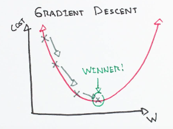

.. _basics:

======
Basics
======

Fundamental machine learning algorithms and concepts

Linear regression
=================

When a model's predicted output is continuous and has a constant slope.
At its most basic, it takes the form of:

.. math::

  y = ax + b

* **Pros**: fast, no tuning required, highly interpretable, well-understood
* **Cons**: unlikely to produce the best predictive accuracy

(presumes a linear relationship between the features and response)

[[File:Linear_regression_glossary.png]]

A more complex linear equation might look like this:

.. math::

  y = B_0 + B_1 x + B_2 z + B_3 j + B_4 k

A linear regression model would try to "learn" the correct values for
:math:`B_0, B_1, B_2 ..` The independent variables :math:`x, y, j, k`
represent the various attributes of each observation in our sample. For
sales predictions, these attributes might include: day of the week, employee
count, inventory levels, and store location.

.. math::

  y = B_0 + B_1 Day + B_2 Employees + B_3 Inventory + B_4 Location

Best Reads:
* <https://arxiv.org/abs/1511.07122>
* <https://en.wikipedia.org/wiki/Linear_regression>

References:
* <http://people.duke.edu/~rnau/regintro.htm>
* <https://en.wikipedia.org/wiki/Linear_regression>

Logistic Regression
===================

Be the first to contribute!

Cost Functions
==============

Be the first to contribute!

Gradient Descent
================

Gradient Descent is an optimization algorithm used to minimize some function by iteratively moving in the direction of steepest descent as defined by the negative of the gradient. In machine learning, we use gradient descent to update the parameters of our model. Parameters refer to coefficients in linear regression and weights in neural networks.

How it works
------------

Consider the 3-dimensional graph below in the context of a cost function. Our goal is to move from the mountain in the top right corner (high cost) to the dark blue sea in the bottom left (low cost). The arrows represent the direction of steepest descent (negative gradient) from any given point--the direction that decreases the cost function as quickly as possible. `Source <http://www.adalta.it/Pages/-GoldenSoftware-Surfer-010.asp>`_

.. image:: images/gradient_descent.png
    :align: center

Starting at the top of the mountain, we take our first step downhill in the direction specified by the negative gradient. Next we recalculate the negative gradient (passing in the coordinates of our new point) and take another step in the direction it specifies. We continue this process iteratively until we get to the bottom of our graph, or to a point where we can no longer move downhill--a local minimum. `image source <https://youtu.be/5u0jaA3qAGk>`_.

Learning Rate
-------------

The size of these steps is called the *learning rate*. With a high learning rate we can cover more ground each step, but we risk overshooting the lowest point since the slope of the hill is constantly changing. With a very low learning rate, we can confidently move in the direction of the negative gradient since we are recalculating it so frequently. A low learning rate is more precise, but calculating the gradient is time-consuming, so it will take us a very long time to get to the bottom.

Cost Function
-------------

A cost function is a wrapper around our model function that tells us "how good" our model is at making predictions for a given set of parameters. The cost function has its own curve and its own gradients. The slope of this curve tells us how to change our parameters to make the model more accurate! We use the model to make predictions. We use the cost function to update our parameters. Our cost function can take a variety of forms as there are many different cost functions available. Popular cost functions include: Mean Squared Error, Root Mean Squared Error, and [[Log Loss]].

[[File:linear_line_w_cost_function.png]]
[http://www.ken-szulczyk.com/misc/statistical_lecture_10.php source]

Let's take an example from linear regression where our model is :math:`f(x) = mx + b`, where :math:`m` and :math:`b` are the parameters we can tweak.

If we use Mean Squared Error as our cost function, we can calculate total cost of our predictions like this:

.. math::

  MSE =  \frac{1}{N} \sum_{i=1}^{n} (y_i - (mx_i + b))^2

* :math:`N` is the total number of observations (data points)
* :math:`frac{1}{N} \sum_{i=1}^{n}` is the mean
* :math:`y_i` is the actual value of an observation
* :math:`mx_i + b` is our prediction

Example python code for computing cost using MSE:

::

  def cost_function(x, y, m, b):
      N = len(x)
      total_error = 0.0
      for i in range(N):
          total_error += (y[i] - (m*x[i] + b))**2
      return total_error / N

Algorithm
---------

Now let's run gradient descent using our new cost function. There are two "parameters" (i.e. weights) in our cost function we can control: <math>m and <math>b. Since we need to consider the impact each one has on the final prediction, we need to use partial derivatives. We calculate the partial derivatives of the cost function with respect to each parameter and store the results in a gradient.

Given the cost function:

.. math::

  f(m,b) =  \frac{1}{N} \sum_{i=1}^{n} (y_i - (mx_i + b))^2

The gradient can be calculated as:

.. math::

  f'(m,b) =
     \begin{bmatrix}
       \frac{df}{dm}\\
       \frac{df}{db}\\
      \end{bmatrix}
  =
     \begin{bmatrix}
       \frac{1}{N} \sum -2x_i(y_i - (mx_i + b)) \\
       \frac{1}{N} \sum -2(y_i - (mx_i + b)) \\
      \end{bmatrix}

To solve for the gradient, we iterate through our data points using our new <math>m and <math>n values and compute the partial derivatives. This new gradient tells us the slope of our cost function at our current position (i.e. parameters) and the direction we should move to update our parameters. The size of our update is controlled by the learning rate.

Example python code for finding the optimal local minimum:

::

  def update_weights(m, b, X, Y, learning_rate):
      m_deriv = 0
      b_deriv = 0
      N = len(X)
      for i in range(N):
          # Calculate partial derivatives
          # -2x(y - (mx + b))
          m_deriv += -2*X[i] * (Y[i] - (m*X[i] + b))

          # -2(y - (mx + b))
          b_deriv += -2*(Y[i] - (m*X[i] + b))

      # We subtract because the derivatives point in direction of steepest ascent
      m -= (m_deriv / float(N)) * learning_rate
      b -= (b_deriv / float(N)) * learning_rate

      return m, b

Logistic regression
===================

Be the first to contribute!

