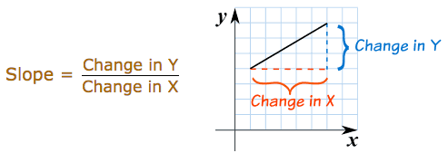
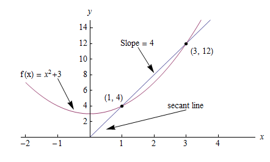

.. _calculus:

========
Calculus
========

.. contents:: :local:

.. _derivative:

Derivatives
===========

A derivative can be defined in two ways:

  #. Instantaneous rate of change (Physics)
  #. Slope of a line at a specific point (Geometry)

Both represent the same principle, but for our purposes it’s easier to explain using the geometric definition.

Geometric definition
--------------------

In geometry slope represents the steepness of a line. It answers the question: how much does :math:`y` or :math:`f(x)` change given a specific change in :math:`x`?

Using this definition we can easily calculate the slope between two points. But what if I asked you, instead of the slope between two points, what is the slope at a single point on the line? In this case there isn’t any obvious "rise-over-run" to calculate. Derivatives help us answer this question.

A derivative outputs an expression we can use to calculate the *instantaneous rate of change*, or slope, at a single point on a line. After solving for the derivative you can use it to calculate the slope at every other point on the line.

Taking the derivative
---------------------

Consider the graph below, where :math:`f(x) = x^2 + 3`.

The slope between (1,4) and (3,12) would be:

.. math::

  slope = \frac{y2-y1}{x2-x1} = \frac{12-4}{3-1} = 4

But how do we calculate the slope at point (1,4) to reveal the change in slope at that specific point?

One way would be to find the two nearest points, calculate their slopes relative to :math:`x` and take the average. But calculus provides an easier, more precise way: compute the derivative. Computing the derivative of a function is essentially the same as our original proposal, but instead of finding the two closest points, we make up an imaginary point an infinitesimally small distance away from :math:`x` and compute the slope between :math:`x` and the new point.

In this way, derivatives help us answer the question: how does :math:`f(x)` change if we make a very very tiny increase to x? In other words, derivatives help *estimate* the slope between two points that are an infinitesimally small distance away from each other. A very, very, very small distance, but large enough to calculate the slope.

In math language we represent this infinitesimally small increase using a limit. A limit is defined as the output value a function approaches as the input value approaches another value. In our case the target value is the specific point at which we want to calculate slope.

Step-by-step
------------

Calculating the derivative is the same as calculating normal slope, however in this case we calculate the slope between our point and a point infinitesimally close to it. We use the variable :math:`h` to represent this infinitesimally distance. Here are the steps:

1. Given the function:

.. math::

  f(x) = x^2

2. Increment :math:`x` by a very small value :math:`h (h = Δx)`

.. math::

  f(x + h) = (x + h)^2

3. Apply the slope formula

.. math::

  \frac{f(x + h) - f(x)}{h}

4. Simplify the equation

.. math::

  \frac{x^2 + 2xh + h^2 - x^2}{h} \\

  \frac{2xh+h^2}{h} = 2x+h

5. Set :math:`h` to 0 (the limit as :math:`h` heads toward 0)

.. math::

  {2x + 0} = {2x}

So what does this mean? It means for the function :math:`f(x) = x^2`, the slope at any point equals :math:`2x`. The formula is defined as:

.. math::

  \lim_{h\to0}\frac{f(x+h) - f(x)}{h}

.. rubric:: Code

Let's write code to calculate the derivative for :math:`f(x) = x^2`. We know the derivative should be :math:`2x`.

::

  def getDeriv(func, x):
    h = 0.0001
    return (func(x+h) - func(x)) / h

  x = 3
  derivative = getDeriv(x**2, x)
  actual = 2*x

  derivative, actual = 6.0001, 6

Machine learning use cases
--------------------------

Machine learning uses derivatives to find optimal solutions to problems. It's useful in optimization functions like Gradient Descent because it helps us decide whether to increase or decrease our weights in order to maximize or minimize some metrics (e.g. loss). It also helps us model nonlinear functions as linear functions (tangent lines), which have constant slopes. With a constant slope we can decide whether to move up or down the slope (increase or decrease our weights) to get closer to the target value (class label).

.. _gradient:

Gradients
=========

A gradient is a vector that stores the partial derivatives of multivariable functions. It helps us calculate the slope at a specific point on a curve for functions with multiple independent variables. In order to calculate this more complex slope, we need to isolate each variable to determine how it impacts the output on its own. To do this we iterate through each of the variables and calculate the derivative of the function after holding all other variables constant. Each iteration produces a partial derivative which we store in the gradient.

Partial derivatives
-------------------

In functions with 2 or more variables, the partial derivative is the derivative of one variable with respect to the others. If we change :math:`x`, but hold all other variables constant, how does :math:`f(x,z)` change? That's one partial derivative. The next variable is :math:`z`. If we change :math:`z` but hold :math:`x` constant, how does :math:`f(x,z)` change? We store partial derivatives in a gradient, which represents the full derivative of the multivariable function.

Step-by-step
------------

Here are the steps to calculate the gradient for a multivariable function:

1. Given a multivariable function

.. math::

  f(x,z) = 2z^3x^2

2. Calculate the derivative with respect to :math:`x`

.. math::

  \frac{df}{dx}(x,z)

3. Swap :math:`2z^3` with a constant value :math:`b`

.. math::

  f(x,z) = bx^2

4. Calculate the derivative with :math:`b` constant

.. math::

  \begin{align}
  \frac{df}{dx} & = \lim_{h\to0}\frac{f(x+h) - f(x)}{h} \\
                & = \lim_{h\to0}\frac{b(x+h)^2 - b(x^2)}{h} \\
                & = \lim_{h\to0}\frac{b((x+h)(x+h)) - bx^2}{h} \\
                & = \lim_{h\to0}\frac{b((x^2 + xh + hx + h^2)) - bx^2}{h} \\
                & = \lim_{h\to0}\frac{bx^2 + 2bxh + bh^2 - bx^2}{h} \\
                & = \lim_{h\to0}\frac{2bxh + bh^2}{h} \\
                & = \lim_{h\to0}\frac{2bxh + bh^2}{h} \\
                & = \lim_{h\to0} 2bx + bh \\
  \end{align}

As :math:`h —> 0`...

  2bx + 0

5. Swap :math:`2z^3` back into the equation, to find the derivative with respect to :math:`x`.

.. math::

  \begin{align}
  \frac{df}{dx}(x,z) &= 2(2z^3)x \\
                     &= 4z^3x
  \end{align}

6. Repeat the above steps to calculate the derivative with respect to :math:`z`

.. math::

  \frac{df}{dz}(x,z) = 6x^2z^2

7. Store the partial derivatives in a gradient

.. math::

   \nabla f(x,z)=\begin{bmatrix}
       \frac{df}{dx} \\
       \frac{df}{dz} \\
      \end{bmatrix}
   =\begin{bmatrix}
       4z^3x \\
       6x^2z^2 \\
      \end{bmatrix}

Directional derivatives
-----------------------

Another important concept is directional derivatives. When calculating the partial derivatives of multivariable functions we use our old technique of analyzing the impact of infinitesimally small increases to each of our independent variables. By increasing each variable we alter the function output in the direction of the slope.

But what if we want to change directions? For example, imagine we’re traveling north through mountainous terrain on a 3-dimensional plane. The gradient we calculated above tells us we’re traveling north at our current location. But what if we wanted to travel southwest? How can we determine the steepness of the hills in the southwest direction? Directional derivatives help us find the slope if we move in a direction different from the one specified by the gradient.

.. rubric:: Math

The directional derivative is computed by taking the dot product [11]_ of the gradient of :math:`f` and a unit vector :math:`\vec{v}` of "tiny nudges" representing the direction. The unit vector describes the proportions we want to move in each direction. The output of this calculation is a scalar number representing how much :math:`f` will change if the current input moves with vector :math:`\vec{v}`.

Let's say you have the function :math:`f(x,y,z)` and you want to compute its directional derivative along the following vector [2]_:

.. math::

 \vec{v}=\begin{bmatrix}
   2 \\
   3 \\
   -1  \\
  \end{bmatrix}

As described above, we take the dot product of the gradient and the directional vector:

.. math::

   \begin{bmatrix}
     \frac{df}{dx} \\
     \frac{df}{dx} \\
     \frac{df}{dx}  \\
    \end{bmatrix}
    \cdot
    \begin{bmatrix}
       2 \\
       3 \\
       -1  \\
    \end{bmatrix}

We can rewrite the dot product as:

.. math::

  \nabla_\vec{v} f = 2 \frac{df}{dx} + 3 \frac{df}{dy} - 1 \frac{df}{dz}

This should make sense because a tiny nudge along :math:`\vec{v}` can be broken down into two tiny nudges in the x-direction, three tiny nudges in the y-direction, and a tiny nudge backwards, by −1 in the z-direction.

Useful properties
-----------------

There are two additional properties of gradients that are especially useful in deep learning. The gradient of a function:

  #. Always points in the direction of greatest increase of a function (`explained here <https://betterexplained.com/articles/understanding-pythagorean-distance-and-the-gradient>`_)
  #. Is zero at a local maximum or local minimum

.. _chain_rule:

Chain rule
==========

The chain rule is a formula for calculating the derivatives of composite functions. Composite functions are functions composed of functions inside other function(s).

How It Works
------------

Given a composite function :math:`f(x) = A(B(x))`, the derivative of :math:`f(x)` equals the product of the derivative of :math:`A` with respect to :math:`B(x)` and the derivative of :math:`B` with respect to :math:`x`.

.. math::

  \mbox{composite function derivative} = \mbox{outer function derivative} * \mbox{inner function derivative}

For example, given a composite function :math:`f(x)`, where:

.. math::

  f(x) = h(g(x))

The chain rule tells us that the derivative of :math:`f(x)` equals:

.. math::

  \frac{df}{dx} = \frac{dh}{dg} \cdot \frac{dg}{dx}

Step-by-step
------------

Say :math:`f(x)` is composed of two functions :math:`h(x) = x^3` and :math:`g(x) = x^2`. And that:

.. math::

  \begin{align}
  f(x) &= h(g(x)) \\
       &= (x^2)^3 \\
  \end{align}

The derivative of :math:`f(x)` would equal:

.. math::

  \begin{align}
  \frac{df}{dx} &=  \frac{dh}{dg} \frac{dg}{dx} \\
                &=  \frac{dh}{d(x^2)} \frac{dg}{dx}
  \end{align}

.. rubric:: Steps

1. Solve for the inner derivative of :math:`g(x) = x^2`

.. math::

  \frac{dg}{dx} = 2x

2. Solve for the outer derivative of :math:`h(x) = x^3`, using a placeholder :math:`b` to represent the inner function :math:`x^2`

.. math::

  \frac{dh}{db} = 3b^2

3. Swap out the placeholder variable for the inner function

.. math::

  3x^4

4. Return the product of the two derivatives

.. math::

  3x^4 \cdot 2x = 6x^5

Higher dimensions
-----------------

In the above example we assumed a composite function containing a single inner function. But the chain rule can also be applied to higher-order functions like:

.. math::

  f(x) = A(B(C(x)))

The chain rule tells us that the derivative of this function equals:

.. math::

  \frac{df}{dx} = \frac{dA}{dB} \frac{dB}{dC} \frac{dC}{dx}

We can also write this derivative equation :math:`f'` notation:

.. math::

  f' = A'(B(C(x)) \cdot B'(C(x)) \cdot C'(x)

.. rubric:: Steps

Given the function :math:`f(x) = A(B(C(x)))`, lets assume:

.. math::

  \begin{align}
  A(x) & = sin(x) \\
  B(x) & = x^2 \\
  C(x) & = 4x
  \end{align}

The derivatives of these functions would be:

.. math::

  \begin{align}
  A'(x) = cos(x) \\
  B'(x) = 2x \\
  C'(x) = 4
  \end{align}

We can calculate the derivative of :math:`f(x)` using the following formula:

.. math::

  f'(x) = A'( (4x)^2) \cdot B'(4x) \cdot C'(x)

We then input the derivatives and simplify the expression:

.. math::

  \begin{align}
  f'(x) &= cos((4x)^2) \cdot 2(4x) \cdot 4 \\
        &= cos(16x^2) \cdot 8x \cdot 4 \\
        &= cos(16x^2)32x
  \end{align}

.. rubric:: References

.. [1] https://en.wikipedia.org/wiki/Derivative
.. [2] https://www.khanacademy.org/math/multivariable-calculus/multivariable-derivatives/partial-derivative-and-gradient-articles/a/directional-derivative-introduction
.. [3] https://en.wikipedia.org/wiki/Partial_derivative
.. [4] https://en.wikipedia.org/wiki/Gradient
.. [5] https://betterexplained.com/articles/vector-calculus-understanding-the-gradient
.. [6] https://www.mathsisfun.com/calculus/derivatives-introduction.html
.. [7] http://tutorial.math.lamar.edu/Classes/CalcI/DefnOfDerivative.aspx
.. [8] https://www.khanacademy.org/math/calculus-home/taking-derivatives-calc/chain-rule-calc/v/chain-rule-introduction
.. [9] http://tutorial.math.lamar.edu/Classes/CalcI/ChainRule.aspx
.. [10] https://youtu.be/pHMzNW8Agq4?t=1m5s
.. [11] https://en.wikipedia.org/wiki/Dot_product

