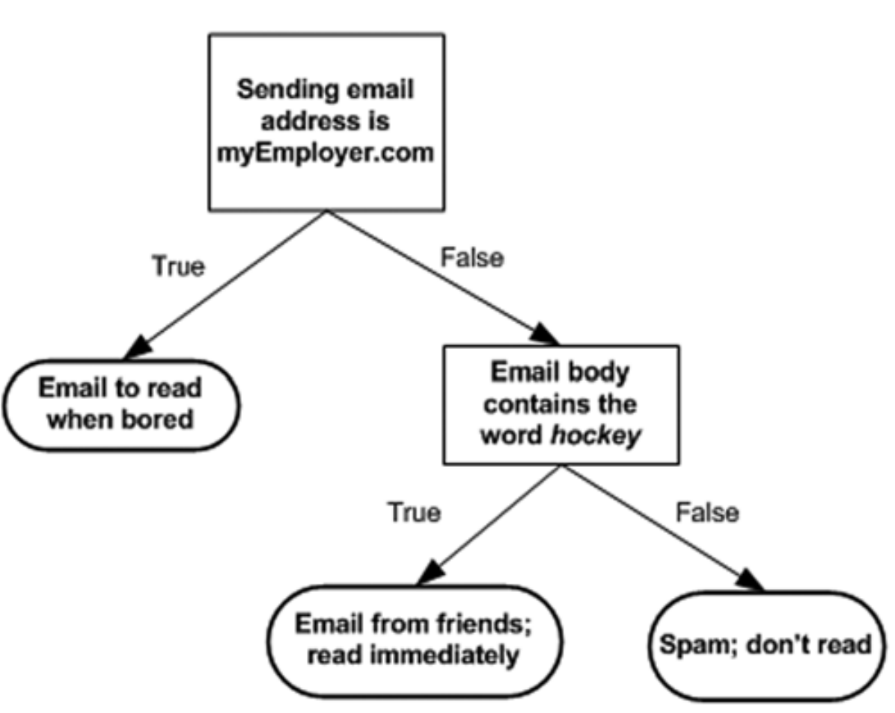

.. _classification_algos:

=========================
Classification Algorithms
=========================

Classification problems is when our output Y is always in categories like positive vs negative in terms of sentiment analysis, dog vs cat in terms of image classification and disease vs no disease in terms of medical diagnosis.

Bayesian
=======

Overlaps..

Boosting
========

Be the first to `contribute! <https://github.com/bfortuner/ml-cheatsheet>`__

Decision Trees
==============
.. rubric:: Introduction

Decision tree works by successively splitting the dataset into small segments until the target variable are the same or until the dataset can no longer be split. It's a greedy algorithm which make the best decision at the given time without concern for the global optimality[2].

The concept behind decision tree is straightforward. The following flowchart show a simple email classification system based on decision tree. If the address is "myEmployer.com", it will classify it to "Email to read when bored". Then if the email contains the word "hockey", this email will be classified as "Email from friends". Otherwise, it will be identified as "Spam: don't read".

The pseudo-code for decision tree is as follows:

.. rubric:: ID3, C4.5 and CART

There are various kinds of decision tree algorithms such as ID3 (Iterative Dichotomiser 3), C4.5 and CART (Classification and Regression Trees).

ID3 (`code example <https://github.com/bfortuner/ml-cheatsheet/blob/master/code/knn.py>`__) creates a multiway tree. For each node, it try to find the categorical feature that will yield the largest information gain for the target variable.

C4.5 is the successor of ID3 and remove the restriction that the feature must be categorical by dynamically define a discrete attribute that partitions the continuous attribute in the discrete set of intervals.

CART is similar to C4.5. But it differs in that it constructs binary tree and support regression problem[3].

The main differences are shown in the follow table:

+-------------------+---------------------+------------------------------------------------------+----------------------------------------------+
|     Dimensions    |         ID3         |                         C4.5                         |                     CART                     |
+-------------------+---------------------+------------------------------------------------------+----------------------------------------------+
|  Split Criterion  |   Information gain  | Information gain ratio (Normalized information gain) | Gini coefficient for classification problems |
+-------------------+---------------------+------------------------------------------------------+----------------------------------------------+
| Types of Features | Categorical feature |           Categorical & numerical features           |       Categorical & numerical features       |
+-------------------+---------------------+------------------------------------------------------+----------------------------------------------+
|  Type of Problem  |    Classification   |                    Classification                    |          Classification & regression         |
+-------------------+---------------------+------------------------------------------------------+----------------------------------------------+
|   Type of Tree    |     Mltiway tree    |                     Mltiway tree                     |                  Binary tree                 |
+-------------------+---------------------+------------------------------------------------------+----------------------------------------------+

K-Nearest Neighbor
==================
.. rubric:: Introduction

K-Nearest Neighbor is a supervised learning algorithm both for classification and regression. The principle is to find the predefined number of training samples closest to the new point, and predict the label from these training samples[1].

For example, when a new point comes, the algorithm will follow these steps:

1. Calculate the Euclidean distance between the new point and all training data
2. Pick the top-K closest training data
3. For regression problem, take the average of the labels as the result; for classification problem, take the most common label of these labels as the result.

.. rubric:: Code

Below is the Numpy implementation of K-Nearest Neighbor function. Refer to `code example <https://github.com/bfortuner/ml-cheatsheet/blob/master/code/knn.py>`__ for details.

.. code-block:: python

    def KNN(training_data, target, k, func):
        """
        training_data: all training data point
        target: new point
        k: user-defined constant, number of closest training data
        func: functions used to get the the target label
        """
        # Step one: calculate the Euclidean distance between the new point and all training data
        neighbors= []
        for index, data in enumerate(training_data):
            # distance between the target data and the current example from the data.
            distance = euclidean_distance(data[:-1], target)
            neighbors.append((distance, index))

        # Step two: pick the top-K closest training data
        sorted_neighbors = sorted(neighbors)
        k_nearest = sorted_neighbors[:k]
        k_nearest_labels = [training_data[i][1] for distance, i in k_nearest]

        # Step three: For regression problem, take the average of the labels as the result;
        #             for classification problem, take the most common label of these labels as the result.
        return k_nearest, func(k_nearest_labels)
..

Logistic Regression
===================

Be the first to `contribute! <https://github.com/bfortuner/ml-cheatsheet>`__

Random Forests
==============

Random Forest Classifier using ID3 Tree: `code example <https://github.com/bfortuner/ml-cheatsheet/blob/master/code/random_forest_classifier.py>`__

Support Vector Machines
=======================

Be the first to `contribute! <https://github.com/bfortuner/ml-cheatsheet>`__

.. rubric:: References

.. [1] https://scikit-learn.org/stable/modules/neighbors.html#nearest-neighbors-classification
.. [2] `Machine Learning in Action by Peter Harrington <https://www.manning.com/books/machine-learning-in-action>`__
.. [3] `Scikit-learn Documentations: Tree algorithms: ID3, C4.5, C5.0 and CART <https://scikit-learn.org/stable/modules/tree.html#tree-algorithms-id3-c4-5-c5-0-and-cart>`__

