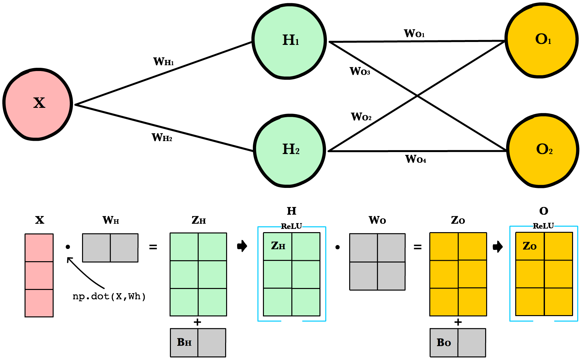
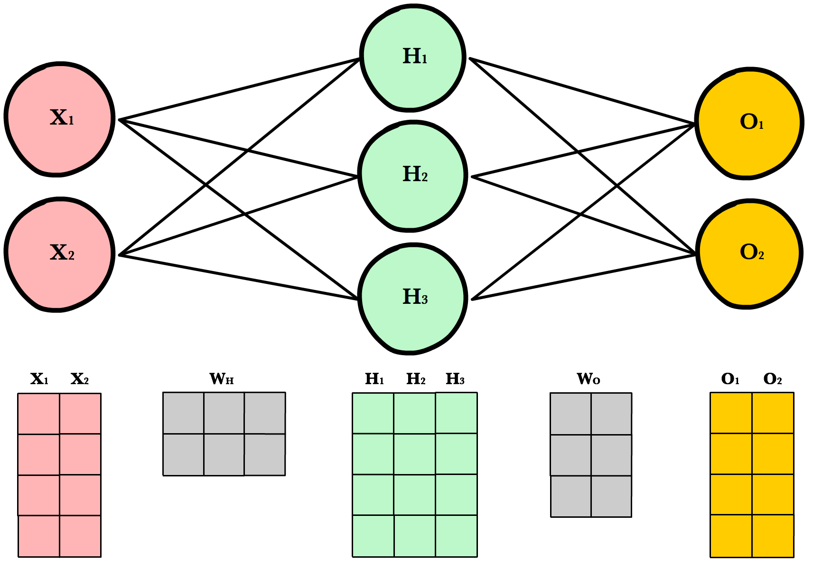
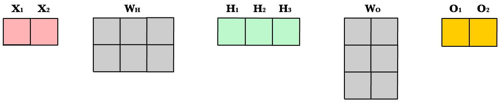
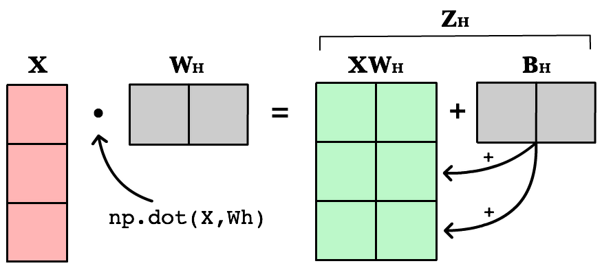

.. _forwardpropagation:

==================
Forwardpropagation
==================

.. contents:: :local:

Simple Network
==============

.. image:: images/neural_network_simple.png
    :align: center

Forward propagation is how neural networks make predictions. Input data is "forward propagated" through the network layer by layer to the final layer which outputs a prediction. For the toy neural network above, a single pass of forward propagation translates mathematically to:

.. math::

  Prediction = A(\;A(\;X W_h\;)W_o\;)

Where :math:`A` is an activation function like :ref:`activation_relu`, :math:`X` is the input and :math:`W_h` and :math:`W_o` are weights.

Steps
-----

1. Calculate the weighted input to the hidden layer by multiplying :math:`X` by the hidden weight :math:`W_h`
2. Apply the activation function and pass the result to the final layer
3. Repeat step 2 except this time :math:`X` is replaced by the hidden layer's output, :math:`H`

Code
----

Let’s write a method feed_forward() to propagate input data through our simple network of 1 hidden layer. The output of this method represents our model’s prediction.

.. literalinclude:: ../code/nn_simple.py
    :language: python
    :lines: 4-15

``x`` is the input to the network, ``Zo`` and ``Zh`` are the weighted inputs and ``Wo`` and ``Wh`` are the weights.

Larger Network
==============

The simple network above is helpful for learning purposes, but in reality neural networks are much larger and more complex. Modern neural networks many more hidden layers, more neurons per layer, more variables per input, more inputs per training set, and more output variables to predict. Here is a slightly larger network that will introduce us to matrices and the matrix operations used to train arbitrarily large neural networks.

.. image:: images/neural_network_w_matrices.png
    :align: center

Architecture
------------

To accomodate arbitrarily large inputs or outputs, we need to make our code more extensible by adding a few parameters to our network's __init__ method: inputLayerSize, hiddenLayerSize, outputLayerSize. We'll still limit ourselves to using one hidden layer, but now we can create layers of different sizes to respond to the different inputs or outputs.

.. literalinclude:: ../code/nn_matrix.py
    :language: python
    :lines: 6-8

Weight Initialization
---------------------

Unlike last time where ``Wh`` and ``Wo`` were scalar numbers, our new weight variables will be numpy arrays. Each array will hold all the weights for its own layer — one weight for each synapse. Below we initialize each array with the numpy's ``np.random.rand(rows, cols)`` method, which returns a matrix of random numbers drawn from a normal distribution (mean 0, variable 1).

.. literalinclude:: ../code/nn_matrix.py
    :language: python
    :pyobject: init_weights

Here's an example of calling ``random.rand()``:

::

  arr = np.random.randn(1, 2)

  print(arr)
  >> [[-0.36094661 -1.30447338]]

  print(arr.shape)
  >> (1,2)

As you'll soon see, there are strict requirements on the dimensions of these weight matrices. The number of *rows* must equal the number of neurons in the previous layer. The number of *columns* must match the number of neurons in the next layer.

A good explanation of random weight initalization can be found in the Stanford CS231 course notes [1]_ chapter on neural networks.

Bias Terms
----------

:ref:`nn_bias` terms allow us to shift our neuron's activation outputs left and right. This helps us model datasets that do not necessarily pass through the origin.

Using the numpy method ``np.full()`` below, we create two 1-dimensional bias arrays filled with the default value ``0.2``. The first argument to ``np.full`` is a tuple of array dimensions. The second is the default value for cells in the array.

.. literalinclude:: ../code/nn_matrix.py
    :language: python
    :pyobject: init_bias

Working with Matrices
---------------------

To take advantage of fast linear algebra techniques and GPUs, we need to store our inputs, weights, and biases in matrices. Here is our neural network diagram again with its underlying matrix representation.

What's happening here? To better understand, let's walk through each of the matrices in the diagram with an emphasis on their dimensions and why the dimensions are what they are. The matrix dimensions above flow naturally from the architecture of our network and the number of samples in our training set.

.. rubric:: Matrix dimensions

+---------+-----------------------+----------------+--------------------------------------------------------------------------------------------------------------------------------------------------------------------------------------------------------------------------------------------------------------------------------------------------------------------------------------------------------------------------------------------+
| **Var** | **Name**              | **Dimensions** | **Explanation**                                                                                                                                                                                                                                                                                                                                                                            |
+---------+-----------------------+----------------+--------------------------------------------------------------------------------------------------------------------------------------------------------------------------------------------------------------------------------------------------------------------------------------------------------------------------------------------------------------------------------------------+
| ``X``   | Input                 | (3, 1)         | Includes 3 rows of training data, and each row has 1 attribute (height, price, etc.)                                                                                                                                                                                                                                                                                                       |
+---------+-----------------------+----------------+--------------------------------------------------------------------------------------------------------------------------------------------------------------------------------------------------------------------------------------------------------------------------------------------------------------------------------------------------------------------------------------------+
| ``Wh``  | Hidden weights        | (1, 2)         | These dimensions are based on number of rows equals the number of attributes for the observations in our training set. The number columns equals the number of neurons in the hidden layer. The dimensions of the weights matrix between two layers is determined by the sizes of the two layers it connects. There is one weight for every input-to-neuron connection between the layers. |
+---------+-----------------------+----------------+--------------------------------------------------------------------------------------------------------------------------------------------------------------------------------------------------------------------------------------------------------------------------------------------------------------------------------------------------------------------------------------------+
| ``Bh``  | Hidden bias           | (1, 2)         | Each neuron in the hidden layer has is own bias constant. This bias matrix is added to the weighted input matrix before the hidden layer applies ReLU.                                                                                                                                                                                                                                     |
+---------+-----------------------+----------------+--------------------------------------------------------------------------------------------------------------------------------------------------------------------------------------------------------------------------------------------------------------------------------------------------------------------------------------------------------------------------------------------+
| ``Zh``  | Hidden weighted input | (1, 2)         | Computed by taking the dot product of X and Wh. The dimensions (1,2) are required by the rules of matrix multiplication. Zh takes the rows of in the inputs matrix and the columns of weights matrix. We then add the hidden layer bias matrix Bh.                                                                                                                                         |
+---------+-----------------------+----------------+--------------------------------------------------------------------------------------------------------------------------------------------------------------------------------------------------------------------------------------------------------------------------------------------------------------------------------------------------------------------------------------------+
| ``H``   | Hidden activations    | (3, 2)         | Computed by applying the Relu function to Zh. The dimensions are (3,2) — the number of rows matches the number of training samples and the number of columns equals the number of neurons. Each column holds all the activations for a specific neuron.                                                                                                                                    |
+---------+-----------------------+----------------+--------------------------------------------------------------------------------------------------------------------------------------------------------------------------------------------------------------------------------------------------------------------------------------------------------------------------------------------------------------------------------------------+
| ``Wo``  | Output weights        | (2, 2)         | The number of rows matches the number of hidden layer neurons and the number of columns equals the number of output layer neurons. There is one weight for every hidden-neuron-to-output-neuron connection between the layers.                                                                                                                                                             |
+---------+-----------------------+----------------+--------------------------------------------------------------------------------------------------------------------------------------------------------------------------------------------------------------------------------------------------------------------------------------------------------------------------------------------------------------------------------------------+
| ``Bo``  | Output bias           | (1, 2)         | There is one column for every neuron in the output layer.                                                                                                                                                                                                                                                                                                                                  |
+---------+-----------------------+----------------+--------------------------------------------------------------------------------------------------------------------------------------------------------------------------------------------------------------------------------------------------------------------------------------------------------------------------------------------------------------------------------------------+
| ``Zo``  | Output weighted input | (3, 2)         | Computed by taking the dot product of H and Wo and then adding the output layer bias Bo. The dimensions are (3,2) representing the rows of in the hidden layer matrix and the columns of output layer weights matrix.                                                                                                                                                                      |
+---------+-----------------------+----------------+--------------------------------------------------------------------------------------------------------------------------------------------------------------------------------------------------------------------------------------------------------------------------------------------------------------------------------------------------------------------------------------------+
| ``O``   | Output activations    | (3, 2)         | Each row represents a prediction for a single observation in our training set. Each column is a unique attribute we want to predict. Examples of two-column output predictions could be a company's sales and units sold, or a person's height and weight.                                                                                                                                 |
+---------+-----------------------+----------------+--------------------------------------------------------------------------------------------------------------------------------------------------------------------------------------------------------------------------------------------------------------------------------------------------------------------------------------------------------------------------------------------+

Dynamic Resizing
----------------

Before we continue I want to point out how the matrix dimensions change with changes to the network architecture or size of the training set. For example, let’s build a network with 2 input neurons, 3 hidden neurons, 2 output neurons, and 4 observations in our training set.

Now let's use same number of layers and neurons but reduce the number of observations in our dataset to **1 instance**:

As you can see, the number of columns in all matrices remains the same. The only thing that changes is the number of rows the layer matrices, which fluctuate with the size of the training set. The dimensions of the weight matrices remain unchanged. This shows us we can use the same network, the same lines of code, to process any number of observations.

Refactoring Our Code
--------------------

Here is our new feed forward code which accepts matrices instead of scalar inputs.

.. literalinclude:: ../code/nn_matrix.py
    :language: python
    :pyobject: feed_forward

.. rubric:: Weighted input

The first change is to update our weighted input calculation to handle matrices. Using dot product, we multiply the input matrix by the weights connecting them to the neurons in the next layer. Next we add the bias vector using matrix addition.

::

  Zh = np.dot(X, Wh) + Bh

The first column in ``Bh`` is added to all the rows in the first column of resulting dot product of ``X`` and ``Wh``. The second value in ``Bh`` is added to all the elements in the second column. The result is a new matrix, ``Zh`` which has a column for every neuron in the hidden layer and a row for every observation in our dataset. Given all the layers in our network are *fully-connected*, there is one weight for every neuron-to-neuron connection between the layers.

The same process is repeated for the output layer, except the input is now the hidden layer activation ``H`` and the weights ``Wo``.

.. rubric:: ReLU activation

The second change is to refactor ReLU to use elementwise multiplication on matrices. It's only a small change, but its necessary if we want to work with matrices. ``np.maximum()`` is actually extensible and can handle both scalar and array inputs.

.. literalinclude:: ../code/nn_matrix.py
    :language: python
    :pyobject: relu

In the hidden layer activation step, we apply the ReLU activation function ``np.maximum(0,Z)`` to every cell in the new matrix. The result is a matrix where all negative values have been replaced by 0. The same process is repeated for the output layer, except the input is ``Zo``.

Final Result
------------

Putting it all together we have the following code for forward propagation with matrices.

.. literalinclude:: ../code/nn_matrix.py
    :language: python
    :lines: 6-60

.. rubric:: References

.. [1] http://cs231n.github.io/neural-networks-2/#init

