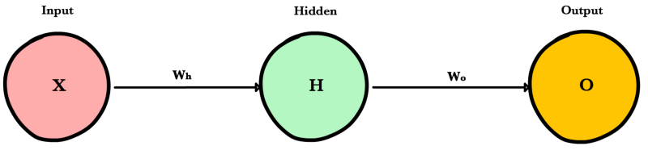

.. _forwardpropagation:

==================
Forwardpropagation
==================

.. contents:: :local:

Overview
========

Forward propagation is how neural networks make predictions. Input data is "forward propagated" through the network layer by layer to the final layer which outputs a prediction. For the toy neural network above, a single pass of forward propagation translates mathematically to:

.. math::

  Prediction = A(\;A(X W_h)W_o\;)

Where :math:`A` is an activation function like :ref:`relu`, :math:`X` is the input and :math:`W_h` and :math:`W_o` are weights.

Steps
=====

First, we calculate the input to the hidden layer by multiplying :math:`X` by the hidden weight :math:`W_h`. Next, we apply the activation function and pass the result to the final layer, where the process is repeated except this time :math:`X` is replaced by the hidden layer's output, :math:`H`.

Code example
============
Let’s write a method feed_forward() to propagate input data through our simple network of 1 hidden layer. The output of this method represents our model’s prediction.

.. literalinclude:: ../code/nn_simple.py
    :language: python
    :lines: 4-15

``x`` is the input to the network, ``Zo`` and ``Zh`` are the weighted inputs and ``Wo`` and ``Wh`` are the weights.

..    :pyobject: MyClass   #Target a specific class.function in a file

.. rubric:: References

.. [1] Example

