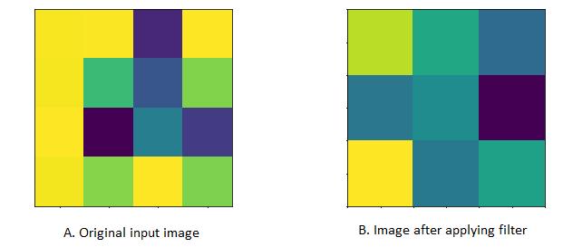
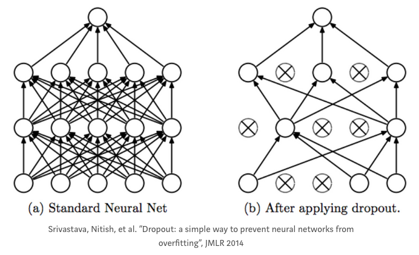
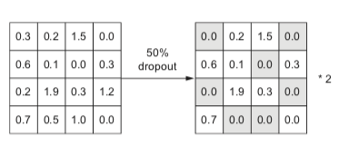
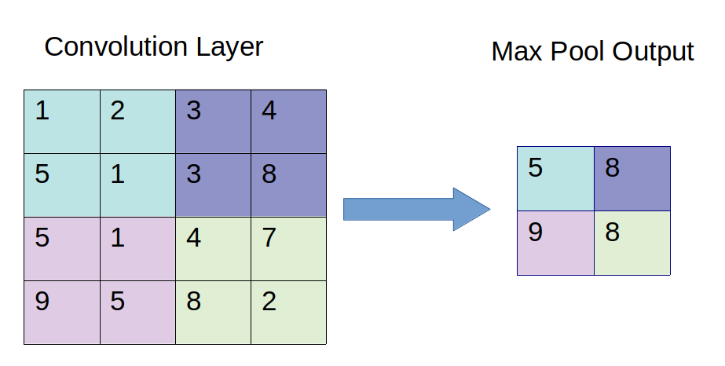
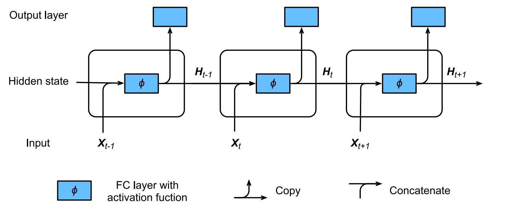

.. _layers:

======
Layers
======

.. contents:: :local:

BatchNorm
---------

BatchNorm accelerates convergence by reducing internal covariate shift inside each batch.
If the individual observations in the batch are widely different, the gradient
updates will be choppy and take longer to converge.

The batch norm layer normalizes the incoming activations and outputs a new batch
where the mean equals 0 and standard deviation equals 1. It subtracts the mean
and divides by the standard deviation of the batch.

.. rubric:: Code

Code example from `Agustinus Kristiadi <https://wiseodd.github.io/techblog/2016/07/04/batchnorm/>`_

.. literalinclude:: ../code/layers.py
      :pyobject: BatchNorm

.. rubric:: Further reading

- `Original Paper <https://arxiv.org/abs/1502.03167>`_
- `Implementing BatchNorm in Neural Net <https://wiseodd.github.io/techblog/2016/07/04/batchnorm/>`_
- `Understanding the backward pass through Batch Norm <https://kratzert.github.io/2016/02/12/understanding-the-gradient-flow-through-the-batch-normalization-layer.html>`_

Convolution
-----------

In CNN, a convolution is a linear operation that involves multiplication of weight (kernel/filter) with the input and it does most of the heavy lifting job.

Convolution layer consists of 2 major component 1. Kernel(Filter) 2. Stride 

1. Kernel (Filter): A convolution layer can have more than one filter. The size of the filter should be smaller than the size of input dimension. It is intentional as it allows filter to be applied multiple times at difference point (position) on the input.Filters are helpful in understanding and identifying important features from given input. By applying different filters (more than one filter) on the same input helps in extracting different features from given input. Output from multiplying filter with the input gives Two dimensional array. As such, the output array from this operation is called "Feature Map".  

2. Stride: This property controls the movement of filter over input. when the value is set to 1, then filter moves 1 column at a time over input. When the value is set to 2 then the filer jump 2 columns at a time as filter moves over the input. 

.. rubric:: Code

.. code-block:: python

      # this code demonstate on how Convolution works
      # Assume we have a image of 4 X 4 and a filter fo 2 X 2 and Stride = 1 
      
      def conv_filter_ouput(input_img_section,filter_value):
            # this method perfromas the multiplication of input and filter 
            # returns singular value

            value = 0 
            for i in range(len(filter_value)):
                  for j in range(len(filter_value[0])):
                        value = value + (input_img_section[i][j]*filter_value[i][j])
            return value

      img_input = [[260.745, 261.332, 112.27 , 262.351],
       [260.302, 208.802, 139.05 , 230.709],
       [261.775,  93.73 , 166.118, 122.847],
       [259.56 , 232.038, 262.351, 228.937]]   

      filter = [[1,0],
         [0,1]]
      
      filterX,filterY = len(filter),len(filter[0])
      filtered_result = [] 
      for i in range(0,len(img_mx)-filterX+1):
      clm = []
      for j in range(0,len(img_mx[0])-filterY+1):
            clm.append(conv_filter_ouput(img_mx[i:i+filterX,j:j+filterY],filter))
      filtered_result.append(clm)
      
      print(filtered_result)

.. rubric:: Further reading
- `cs231n reference  <http://cs231n.github.io/convolutional-networks/>`_

Dropout
-------

A dropout layer takes the output of the previous layer's activations and randomly sets a certain fraction (dropout rate) of the activatons to 0, cancelling or 'dropping' them out.

It is a common regularization technique used to prevent overfitting in Neural Networks.

The dropout rate is the tunable hyperparameter that is adjusted to measure performance with different values. It is typically set between 0.2 and 0.5 (but may be arbitrarily set).

Dropout is only used during training; At test time, no activations are dropped, but scaled down by a factor of dropout rate. This is to account for more units being active during test time than training time.

For example:

 - A layer in a neural net outputs a tensor (matrix) A of shape (batch_size, num_features).
 - The dropout rate of the layer is set to 0.5 (50%).
 - A random 50% of the values in A will be set to 0.
 - These will then be multiplied with the weight matrix to form the inputs to the next layer.

The premise behind dropout is to introduce noise into a layer in order to disrupt any interdependent learning or coincidental patterns that may occur between units in the layer, that aren't significant.

.. rubric:: Code

.. code-block:: python

      # layer_output is a 2D numpy matrix of activations

      layer_output *= np.random.randint(0, high=2, size=layer_output.shape) # dropping out values

      # scaling up by dropout rate during TRAINING time, so no scaling needs to be done at test time
      layer_output /= 0.5 
      # OR
      layer_output *= 0.5 # Scaling down during TEST time.

.. [2]

This results in the following operation.

All reference, images and code examples, unless mentioned otherwise, are from section 4.4.3 of `Deep Learning for Python <https://www.manning.com/books/deep-learning-with-python>`_ by François Chollet. 

.. [2]

Linear
------

Be the first to `contribute! <https://github.com/bfortuner/ml-cheatsheet>`__

LSTM
----

Be the first to `contribute! <https://github.com/bfortuner/ml-cheatsheet>`__

Pooling
-------

Pooling layers often take convolution layers as input. A complicated dataset with many object will require a large number of filters, each responsible finding pattern in an image so the dimensionally of convolutional layer can get large. It will cause an increase of parameters, which can lead to over-fitting. Pooling layers are methods for reducing this high dimensionally. Just like the convolution layer, there is kernel size and stride. The size of the kernel is smaller than the feature map. For most of the cases the size of the kernel will be 2X2 and the stride of 2. There are mainly two types of pooling layers.

The first type is max pooling layer.
Max pooling layer will take a stack of feature maps (convolution layer) as input. The value of the node in the max pooling layer is calculated by just the maximum of the pixels contained in the window.

The other type of pooling layer is the Average Pooling layer.
Average pooling layer calculates the average of pixels contained in the window. Its not used often but you may see this used in applications for which smoothing an image is preferable.

.. rubric:: Code
.. code-block:: python

    def max_pooling(feature_map, size=2, stride=2):
    	"""
	:param feature_map: Feature matrix of shape (height, width, layers)
    	:param size: size of kernal
    	:param stride: movement speed of kernal
    	:return: max-pooled feature vector
	""" 
    	pool_shape = (feature_map.shape[0]//stride, feature_map.shape[1]//stride, feature_map.shape[-1]) #shape of output
    	pool_out = numpy.zeros(pool_shape) 
    	for layer in range(feature_map.shape[-1]):
        	#for each layer
        	row = 0
        	for r in numpy.arange(0,feature_map.shape[0], stride):
        	    col = 0
        	    for c in numpy.arange(0, feature_map.shape[1], stride):
        	        pool_out[row, col, layer] = numpy.max([feature_map[c:c+size,  r:r+size, layer]])
        	        col = col + 1
        	    row = row +1
    	return pool_out

RNN
---
RNN (Recurrent Neural Network) is the neural network with hidden state, which captures the historical information up to current timestep. Because the hidden state of current state uses the same definition as that in previous timestep, which means the computation is recurrent, hence it is called recurrent neural network.(Ref 2)

The structure is as follows:

.. rubric:: Code
For detail code, refer to `layers.py <https://github.com/bfortuner/ml-cheatsheet/blob/master/code/layers.py>`__

.. code-block:: python

    class RNN:
        def __init__(self, input_dim: int, hidden_dim: int, output_dim: int, batch_size=1) -> None:
            self.input_dim = input_dim
            self.hidden_dim = hidden_dim
            self.out_dim = output_dim
            self.batch_size = batch_size
            # initialization
            self.params = self._init_params()
            self.hidden_state = self._init_hidden_state()

        def _init_params(self) -> List[np.array]:
            scale = 0.01
            Waa = np.random.normal(scale=scale, size=[self.hidden_dim, self.hidden_dim])
            Wax = np.random.normal(scale=scale, size=[self.hidden_dim, self.input_dim])
            Wy = np.random.normal(scale=scale, size=[self.out_dim, self.hidden_dim])
            ba = np.zeros(shape=[self.hidden_dim, 1])
            by = np.zeros(shape=[self.out_dim, 1])
            return [Waa, Wax, Wy, ba, by]

        def _init_hidden_state(self) -> np.array:
            return np.zeros(shape=[self.hidden_dim, self.batch_size])

        def forward(self, input_vector: np.array) -> np.array:
            """
            input_vector:
                dimension: [num_steps, self.input_dim, self.batch_size]
            out_vector:
                dimension: [num_steps, self.output_dim, self.batch_size]
            """
            Waa, Wax, Wy, ba, by = self.params
            output_vector = []
            for vector in input_vector:
                self.hidden_state = np.tanh(
                    np.dot(Waa, self.hidden_state) + np.dot(Wax, vector) + ba
                )
                y = softmax(
                    np.dot(Wy, self.hidden_state) + by
                )
                output_vector.append(y)
            return np.array(output_vector)

    if __name__ == "__main__":
        input_data = np.array([
            [
                [1, 3]
                , [2, 4]
                , [3, 6]
            ]
            , [
                [4, 3]
                , [3, 4]
                , [1, 5]
            ]
        ])
        batch_size = 2
        input_dim = 3
        output_dim = 4
        hidden_dim = 5
        time_step = 2
        rnn = RNN(input_dim=input_dim, batch_size=batch_size, output_dim=output_dim, hidden_dim=hidden_dim)
        output_vector = rnn.forward(input_vector=input_data)
        print("RNN:")
        print(f"Input data dimensions: {input_data.shape}")
        print(f"Output data dimensions {output_vector.shape}")
        ## We will get the following output:
        ##  RNN:
        ## Input data dimensions: (2, 3, 2)
        ## Output data dimensions (2, 4, 2)

.. rubric:: References

.. [1] http://www.deeplearningbook.org/contents/convnets.html
.. [2] “4.4.3, Fundamentals of Machine Learning: Adding Dropout.” `Deep Learning for Python <https://www.manning.com/books/deep-learning-with-python>`_, by Chollet, François. Manning Publications Co., 2018, pp. 109–110.
.. [3] `Dive into Deep Learning https://d2l.ai/index.html`_, by Zhang, Aston and Lipton, Zachary C. and Li, Mu and Smola, Alexander J.