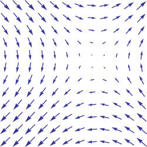
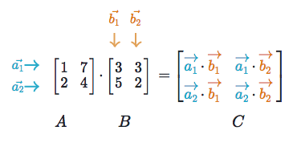

.. _linear_algebra:

==============
Linear algebra
==============

.. toctree::
  :maxdepth: 1
  :titlesonly:

Linear algebra is a mathematical toolbox that offers helpful techniques for manipulating groups of numbers simultaneously. It provides structures like vectors and matrices (spreadsheets) to hold these numbers and new rules for how to add, subtract, multiply, and divide them. Some of the content below is from my linear algebra `post <https://medium.com/p/cd67aba4526c>`_ on Medium.

Vectors
=======

Vectors are 1-dimensional arrays of numbers or terms. In geometry, vectors store the magnitude and direction of a potential change to a point. The vector [3, -2] says go right 3 and down 2. A vector with more than one dimension is called a matrix.

Notation
--------
There are a variety of ways to represent vectors. Here are a few you might come across in your reading.

.. math::

  v = \begin{bmatrix}
  1 \\
  2 \\
  3 \\
  \end{bmatrix}
  =
  \begin{pmatrix}
  1 \\
  2 \\
  3 \\
  \end{pmatrix}
  =
  \begin{bmatrix}
  1 & 2 & 3\\
  \end{bmatrix}

Vectors in geometry
-------------------
Vectors typically represent movement from a point. They store both the magnitude and direction of potential changes to a point. The vector [-2,5] says move left 2 units and up 5 units [1]_.

.. image:: images/vectors_geometry.png
    :align: center

A vector can be applied to any point in space. The vector’s direction equals the slope of the hypotenuse created moving up 5 and left 2. Its magnitude equals the length of the hypotenuse.

Scalar operations
-----------------
Scalar operations involve a vector and a number. You modify the vector in-place by adding, subtracting, or multiplying the number from all the values in the vector.

.. math::

  \begin{bmatrix}
  2 \\
  2 \\
  2 \\
  \end{bmatrix}
  +
  1
  =
  \begin{bmatrix}
  3 \\
  3 \\
  3 \\
  \end{bmatrix}

Elementwise operations
----------------------
In elementwise operations like addition, subtraction, and division, values that correspond positionally are combined to produce a new vector. The 1st value in vector A is paired with the 1st value in vector B. The 2nd value is paired with the 2nd, and so on. This means the vectors must have equal dimensions to complete the operation.*

.. math::

  \begin{bmatrix}
  a_1 \\
  a_2 \\
  \end{bmatrix}
  +
  \begin{bmatrix}
  b_1 \\
  b_2 \\
  \end{bmatrix}
  =
  \begin{bmatrix}
  a_1+b_1 \\
  a_2+b_2 \\
  \end{bmatrix}

::

  y = np.array([1,2,3])
  x = np.array([2,3,4])
  y + x = [3, 5, 7]
  y - x = [-1, -1, -1]
  y / x = [.5, .67, .75]

See below for details on broadcasting in numpy.

Dot product
-----------
The dot product of two vectors is a scalar. Dot product of vectors and matrices (matrix multiplication) is one of the most important operations in deep learning.

.. math::

  \begin{bmatrix}
  a_1 \\
  a_2 \\
  \end{bmatrix}
  \cdot
  \begin{bmatrix}
  b_1 \\
  b_2 \\
  \end{bmatrix}
  = a_1 b_1+a_2 b_2

::

  y = np.array([1,2,3])
  x = np.array([2,3,4])
  np.dot(y,x) = 20

Hadamard product
----------------
Hadamard Product is elementwise multiplication and it outputs a vector.

.. math::

  \begin{bmatrix}
  a_1 \\
  a_2 \\
  \end{bmatrix}
   \odot
  \begin{bmatrix}
  b_1 \\
  b_2 \\
  \end{bmatrix}
  =
  \begin{bmatrix}
  a_1 \cdot b_1 \\
  a_2 \cdot b_2 \\
  \end{bmatrix}

::

  y = np.array([1,2,3])
  x = np.array([2,3,4])
  y * x = [2, 6, 12]

Vector fields
-------------
A vector field shows how far the point (x,y) would hypothetically move if we applied a vector function to it like addition or multiplication. Given a point in space, a vector field shows the power and direction of our proposed change at a variety of points in a graph [2]_.

This vector field is an interesting one since it moves in different directions depending the starting point. The reason is that the vector behind this field stores terms like :math:`2x` or :math:`x^2` instead of scalar values like -2 and 5. For each point on the graph, we plug the x-coordinate into :math:`2x` or :math:`x^2` and draw an arrow from the starting point to the new location. Vector fields are extremely useful for visualizing machine learning techniques like Gradient Descent.

Matrices
========

A matrix is a rectangular grid of numbers or terms (like an Excel spreadsheet) with special rules for addition, subtraction, and multiplication.

Dimensions
----------
We describe the dimensions of a matrix in terms of rows by columns.

.. math::

  \begin{bmatrix}
  2 & 4 \\
  5 & -7 \\
  12 & 5 \\
  \end{bmatrix}
  \begin{bmatrix}
  a² & 2a & 8\\
  18 & 7a-4 & 10\\
  \end{bmatrix}

The first has dimensions (3,2). The second (2,3).

::

  a = np.array([
   [1,2,3],
   [4,5,6]
  ])
  a.shape == (2,3)
  b = np.array([
   [1,2,3]
  ])
  b.shape == (1,3)

Scalar operations
-----------------
Scalar operations with matrices work the same way as they do for vectors. Simply apply the scalar to every element in the matrix — add, subtract, divide, multiply, etc.

.. math::

  \begin{bmatrix}
  2 & 3 \\
  2 & 3 \\
  2 & 3 \\
  \end{bmatrix}
  +
  1
  =
  \begin{bmatrix}
  3 & 4 \\
  3 & 4 \\
  3 & 4 \\
  \end{bmatrix}

::

  # Addition
  a = np.array(
  [[1,2],
   [3,4]])
  a + 1
  [[2,3],
   [4,5]]

Elementwise operations
----------------------
In order to add, subtract, or divide two matrices they must have equal dimensions. We combine corresponding values in an elementwise fashion to produce a new matrix.

.. math::

  \begin{bmatrix}
  a & b \\
  c & d \\
  \end{bmatrix}
  +
  \begin{bmatrix}
  1 & 2\\
  3 & 4 \\
  \end{bmatrix}
  =
  \begin{bmatrix}
  a+1 & b+2\\
  c+3 & d+4 \\
  \end{bmatrix}

::

  a = np.array([
   [1,2],
   [3,4]])
  b = np.array([
   [1,2],
   [3,4]])

  a + b
  [[2, 4],
   [6, 8]]

  a — b
  [[0, 0],
   [0, 0]]

Hadamard product
----------------
Hadamard product of matrices is an elementwise operation. Values that correspond positionally are multiplied to produce a new matrix.

.. math::

  \begin{bmatrix}
  a_1 & a_2 \\
  a_3 & a_4 \\
  \end{bmatrix}
  \odot
  \begin{bmatrix}
  b_1 & b_2 \\
  b_3 & b_4 \\
  \end{bmatrix}
  =
  \begin{bmatrix}
  a_1 \cdot b_1 & a_2 \cdot b_2 \\
  a_3 \cdot b_3 & a_4 \cdot b_4 \\
  \end{bmatrix}

::

  a = np.array(
  [[2,3],
   [2,3]])
  b = np.array(
  [[3,4],
   [5,6]])

  # Uses python's multiply operator
  a * b
  [[ 6, 12],
   [10, 18]]

In numpy you can take the Hadamard product of a matrix and vector as long as their dimensions meet the requirements of broadcasting.

.. math::

  \begin{bmatrix}
  {a_1} \\
  {a_2} \\
  \end{bmatrix}
  \odot
  \begin{bmatrix}
  b_1 & b_2 \\
  b_3 & b_4 \\
  \end{bmatrix}
  =
  \begin{bmatrix}
  a_1 \cdot b_1 & a_1 \cdot b_2 \\
  a_2 \cdot b_3 & a_2 \cdot b_4 \\
  \end{bmatrix}

Matrix transpose
----------------
Neural networks frequently process weights and inputs of different sizes where the dimensions do not meet the requirements of matrix multiplication. Matrix transpose provides a way to “rotate” one of the matrices so that the operation complies with multiplication requirements and can continue. There are two steps to transpose a matrix:

  1. Rotate the matrix right 90°

  2. Reverse the order of elements in each row (e.g. [a b c] becomes [c b a])

As an example, transpose matrix M into T:

.. math::

  \begin{bmatrix}
  a & b \\
  c & d \\
  e & f \\
  \end{bmatrix}
  \quad \Rightarrow \quad
  \begin{bmatrix}
  a & c & e \\
  b & d & f \\
  \end{bmatrix}

::

  a = np.array([
     [1, 2],
     [3, 4]])

  a.T
  [[1, 3],
   [2, 4]]

Matrix multiplication
---------------------
Matrix multiplication specifies a set of rules for multiplying matrices together to produce a new matrix.

**Rules**

Not all matrices are eligible for multiplication. In addition, there is a requirement on the dimensions of the resulting matrix output. Source.

  1. The number of columns of the 1st matrix must equal the number of rows of the 2nd

  2. The product of an M x N matrix and an N x K matrix is an M x K matrix. The new matrix takes the rows of the 1st and columns of the 2nd

**Steps**

Matrix multiplication relies on dot product to multiply various combinations of rows and columns. In the image below, taken from Khan Academy’s excellent linear algebra course, each entry in Matrix C is the dot product of a row in matrix A and a column in matrix B [3]_.

The operation a1 · b1 means we take the dot product of the 1st row in matrix A (1, 7) and the 1st column in matrix B (3, 5).

.. math::

  a_1 \cdot b_1 =
  \begin{bmatrix}
  1 \\
  7 \\
  \end{bmatrix}
  \cdot
  \begin{bmatrix}
  3 \\
  5 \\
  \end{bmatrix}
  = (1 \cdot 3) + (7 \cdot 5) = 38

Here’s another way to look at it:

.. math::

  \begin{bmatrix}
  a & b \\
  c & d \\
  e & f \\
  \end{bmatrix}
  \cdot
  \begin{bmatrix}
  1 & 2 \\
  3 & 4 \\
  \end{bmatrix}
  =
  \begin{bmatrix}
  1a + 3b & 2a + 4b \\
  1c + 3d & 2c + 4d \\
  1e + 3f & 2e + 4f \\
  \end{bmatrix}

Test yourself
-------------

1. What are the dimensions of the matrix product?

.. math::

  \begin{bmatrix}
  1 & 2 \\
  5 & 6 \\
  \end{bmatrix}
  \cdot
  \begin{bmatrix}
  1 & 2 & 3 \\
  5 & 6 & 7 \\
  \end{bmatrix}
  = \text{2 x 3}

2. What are the dimensions of the matrix product?

.. math::

  \begin{bmatrix}
  1 & 2 & 3 & 4 \\
  5 & 6 & 7 & 8 \\
  9 & 10 & 11 & 12 \\
  \end{bmatrix}
  \cdot
  \begin{bmatrix}
  1 & 2 \\
  5 & 6 \\
  3 & 0 \\
  2 & 1 \\
  \end{bmatrix}
  = \text{3 x 2}

3. What is the matrix product?

.. math::

  \begin{bmatrix}
  2 & 3 \\
  1 & 4 \\
  \end{bmatrix}
  \cdot
  \begin{bmatrix}
  5 & 4 \\
  3 & 5 \\
  \end{bmatrix}
  =
  \begin{bmatrix}
  19 & 23 \\
  17 & 24 \\
  \end{bmatrix}

4. What is the matrix product?}

.. math::

  \begin{bmatrix}
  3 \\
  5 \\
  \end{bmatrix}
  \cdot
  \begin{bmatrix}
  1 & 2 & 3\\
  \end{bmatrix}
  =
  \begin{bmatrix}
  3 & 6 & 9 \\
  5 & 10 & 15 \\
  \end{bmatrix}

5. What is the matrix product?

.. math::

  \begin{bmatrix}
  1 & 2 & 3\\
  \end{bmatrix}
  \cdot
  \begin{bmatrix}
  4 \\
  5 \\
  6 \\
  \end{bmatrix}
  =
  \begin{bmatrix}
  32 \\
  \end{bmatrix}

Numpy dot product
-----------------
Numpy uses the function np.dot(A,B) for both vector and matrix multiplication. It has some other interesting features and gotchas so I encourage you to read the documentation here before use.

::

  a = np.array([
   [1, 2]
   ])
  a.shape == (1,2)
  b = np.array([
   [3, 4],
   [5, 6]
   ])
  b.shape == (2,2)

  # Multiply
  mm = np.dot(a,b)
  mm == [13, 16]
  mm.shape == (1,2)

Numpy broadcasting
------------------
In numpy the dimension requirements for elementwise operations are relaxed via a mechanism called broadcasting. Two matrices are compatible if the corresponding dimensions in each matrix (rows vs rows, columns vs columns) meet the following requirements:

  1. The dimensions are equal, or

  2. One dimension is of size 1

::

  a = np.array([
   [1],
   [2]
  ])
  b = np.array([
   [3,4],
   [5,6]
  ])
  c = np.array([
   [1,2]
  ])

  # Same no. of rows
  # Different no. of columns
  # but a has one column so this works
  a * b
  [[ 3, 4],
   [10, 12]]

  # Same no. of columns
  # Different no. of rows
  # but c has one row so this works
  b * c
  [[ 3, 8],
   [5, 12]]

  # Different no. of columns
  # Different no. of rows
  # but both a and c meet the
  # size 1 requirement rule
  a + c
  [[2, 3],
   [3, 4]]

.. rubric:: Tutorials

- `Khan Academy Linear Algebra <https://medium.com/r/?url=https%3A%2F%2Fwww.khanacademy.org%2Fmath%2Flinear-algebra>`_

- `Deep Learning Book Math <https://medium.com/r/?url=http%3A%2F%2Fwww.deeplearningbook.org%2Fcontents%2Fpart_basics.html>`_

- `Andrew Ng Course Notes <https://medium.com/r/?url=https%3A%2F%2Fwww.coursera.org%2Flearn%2Fmachine-learning%2Fresources%2FJXWWS>`_

- `Linear Algebra Better Explained <https://medium.com/r/?url=https%3A%2F%2Fbetterexplained.com%2Farticles%2Flinear-algebra-guide%2F>`_

- `Understanding Matrices Intuitively <https://medium.com/r/?url=http%3A%2F%2Fblog.stata.com%2F2011%2F03%2F03%2Funderstanding-matrices-intuitively-part-1%2F>`_

- `Intro To Linear Algebra <https://medium.com/r/?url=http%3A%2F%2Fwww.holehouse.org%2Fmlclass%2F03_Linear_algebra_review.html>`_

- `Immersive Math <https://medium.com/r/?url=http%3A%2F%2Fimmersivemath.com%2Fila%2Findex.html>`_

.. rubric:: References

.. [1] `Vector Geometry Image <http://mathinsight.org/vector_introduction>`_
.. [2] `Vector Field Image <https://en.wikipedia.org/wiki/Vector_field>`_
.. [3] `Khan Academy Matrix Product Image <https://www.khanacademy.org/math/precalculus/precalc-matrices/properties-of-matrix-multiplication/a/properties-of-matrix-multiplication>`_
