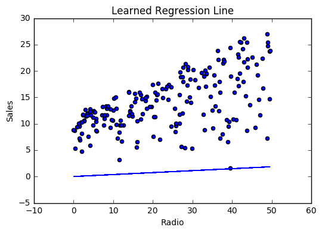
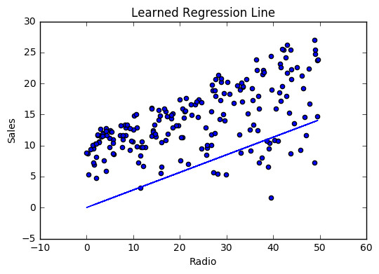
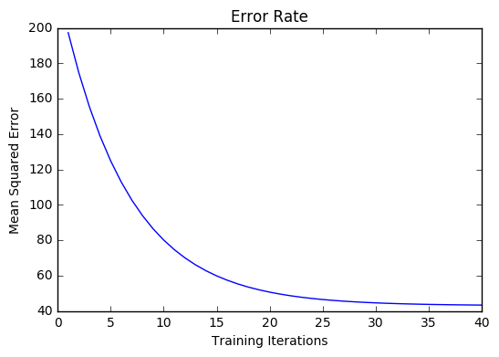
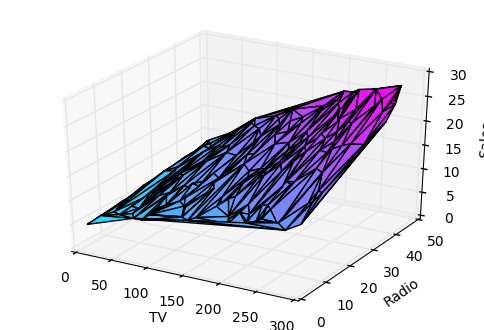
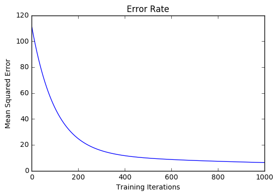

.. _linear_regression:

=================
Linear Regression
=================

.. contents::
    :local:
    :depth: 2

Introduction
============

Linear Regression is a supervised machine learning algorithm where the predicted output is continuous and has a constant slope. It's used to predict values within a continuous range, (e.g. sales, price) rather than trying to classify them into categories (e.g. cat, dog). There are two main types:

.. rubric:: Simple regression

Simple linear regression uses traditional slope-intercept form, where :math:`m` and :math:`b` are the variables our algorithm will try to "learn" to produce the most accurate predictions. :math:`x` represents our input data and :math:`y` represents our prediction.

.. math::

  y = mx + b

.. rubric:: Multivariable regression

A more complex, multi-variable linear equation might look like this, where :math:`w` represents the coefficients, or weights, our model will try to learn.

.. math::

  f(x,y,z) = w_1 x + w_2 y + w_3 z

The variables :math:`x, y, z` represent the attributes, or distinct pieces of information, we have about each observation. For sales predictions, these attributes might include a company's advertising spend on radio, TV, and newspapers.

.. math::

  Sales = w_1 Radio + w_2 TV + w_3 News

Simple regression
=================

Let’s say we are given a `dataset <http://www-bcf.usc.edu/~gareth/ISL/Advertising.csv>`_ with the following columns (features): how much a company spends on Radio advertising each year and its annual Sales in terms of units sold. We are trying to develop an equation that will let us to predict units sold based on how much a company spends on radio advertising. The rows (observations) represent companies.

+--------------+---------------+-----------+
| **Company**  | **Radio ($)** | **Sales** |
+--------------+---------------+-----------+
| Amazon       | 37.8          | 22.1      |
+--------------+---------------+-----------+
| Google       | 39.3          | 10.4      |
+--------------+---------------+-----------+
| Facebook     | 45.9          | 18.3      |
+--------------+---------------+-----------+
| Apple        | 41.3          | 18.5      |
+--------------+---------------+-----------+

Making predictions
------------------

Our prediction function outputs an estimate of sales given a company's radio advertising spend and our current values for *Weight* and *Bias*.

.. math::

  Sales = Weight \cdot Radio + Bias

Weight
  the coefficient for the Radio independent variable. In machine learning we call coefficients *weights*.

Radio
  the independent variable. In machine learning we call these variables *features*.

Bias
  the intercept where our line intercepts the y-axis. In machine learning we can call intercepts *bias*. Bias offsets all predictions that we make.

Our algorithm will try to *learn* the correct values for Weight and Bias. By the end of our training, our equation will approximate the *line of best fit*.

.. image:: images/linear_regression_line_intro.png
    :align: center

.. rubric:: Code

::

  def predict_sales(radio, weight, bias):
      return weight*radio + bias

Cost function
-------------

The prediction function is nice, but for our purposes we don't really need it. What we need is a :doc:`cost function <loss_functions>` so we can start optimizing our weights.

Let's use :ref:`mse` as our cost function. MSE measures the average squared difference between an observation's actual and predicted values. The output is a single number representing the cost, or score, associated with our current set of weights. Our goal is to minimize MSE to improve the accuracy of our model.

.. rubric:: Math

Given our simple linear equation :math:`y = mx + b`, we can calculate MSE as:

.. math::

  MSE =  \frac{1}{N} \sum_{i=1}^{n} (y_i - (m x_i + b))^2

.. note::

  - :math:`N` is the total number of observations (data points)
  - :math:`\frac{1}{N} \sum_{i=1}^{n}` is the mean
  - :math:`y_i` is the actual value of an observation and :math:`m x_i + b` is our prediction

.. rubric:: Code

::

  def cost_function(radio, sales, weight, bias):
      companies = len(radio)
      total_error = 0.0
      for i in range(companies):
          total_error += (sales[i] - (weight*radio[i] + bias))**2
      return total_error / companies

Gradient descent
----------------

To minimize MSE we use :doc:`gradient_descent` to calculate the gradient of our cost function. Gradient descent consists of looking at the error that our weight currently gives us, using the derivative of the cost function to find the gradient (The slope of the cost function using our current weight), and then changing our weight to move in the direction opposite of the gradient. We need to move in the opposite direction of the gradient since the gradient points up the slope instead of down it, so we move in the opposite direction to try to decrease our error. 

.. rubric:: Math

There are two :ref:`parameters <glossary_parameters>` (coefficients) in our cost function we can control: weight :math:`m` and bias :math:`b`. Since we need to consider the impact each one has on the final prediction, we use partial derivatives. To find the partial derivatives, we use the :ref:`chain_rule`. We need the chain rule because :math:`(y - (mx + b))^2` is really 2 nested functions: the inner function :math:`y - (mx + b)` and the outer function :math:`x^2`.

Returning to our cost function:

.. math::

    f(m,b) =  \frac{1}{N} \sum_{i=1}^{n} (y_i - (mx_i + b))^2

We can calculate the gradient of this cost function as:

.. math::
  \begin{align}
  f'(m,b) =
    \begin{bmatrix}
      \frac{df}{dm}\\
      \frac{df}{db}\\
    \end{bmatrix}
  &=
    \begin{bmatrix}
      \frac{1}{N} \sum -x_i \cdot 2(y_i - (mx_i + b)) \\
      \frac{1}{N} \sum -1 \cdot 2(y_i - (mx_i + b)) \\
    \end{bmatrix}\\
  &=
    \begin{bmatrix}
       \frac{1}{N} \sum -2x_i(y_i - (mx_i + b)) \\
       \frac{1}{N} \sum -2(y_i - (mx_i + b)) \\
    \end{bmatrix}
  \end{align}

.. rubric:: Code

To solve for the gradient, we iterate through our data points using our new weight and bias values and take the average of the partial derivatives. The resulting gradient tells us the slope of our cost function at our current position (i.e. weight and bias) and the direction we should update to reduce our cost function (we move in the direction opposite the gradient). The size of our update is controlled by the :ref:`learning rate <glossary_learning_rate>`.

::

  def update_weights(radio, sales, weight, bias, learning_rate):
      weight_deriv = 0
      bias_deriv = 0
      companies = len(radio)

      for i in range(companies):
          # Calculate partial derivatives
          # -2x(y - (mx + b))
          weight_deriv += -2*radio[i] * (sales[i] - (weight*radio[i] + bias))

          # -2(y - (mx + b))
          bias_deriv += -2*(sales[i] - (weight*radio[i] + bias))

      # We subtract because the derivatives point in direction of steepest ascent
      weight -= (weight_deriv / companies) * learning_rate
      bias -= (bias_deriv / companies) * learning_rate

      return weight, bias

.. _simple_linear_regression_training:

Training
--------

Training a model is the process of iteratively improving your prediction equation by looping through the dataset multiple times, each time updating the weight and bias values in the direction indicated by the slope of the cost function (gradient). Training is complete when we reach an acceptable error threshold, or when subsequent training iterations fail to reduce our cost.

Before training we need to initialize our weights (set default values), set our :ref:`hyperparameters <glossary_hyperparameters>` (learning rate and number of iterations), and prepare to log our progress over each iteration.

.. rubric:: Code

::

  def train(radio, sales, weight, bias, learning_rate, iters):
      cost_history = []

      for i in range(iters):
          weight,bias = update_weights(radio, sales, weight, bias, learning_rate)

          #Calculate cost for auditing purposes
          cost = cost_function(radio, sales, weight, bias)
          cost_history.append(cost)

          # Log Progress
          if i % 10 == 0:
              print "iter={:d}    weight={:.2f}    bias={:.4f}    cost={:.2}".format(i, weight, bias, cost)

      return weight, bias, cost_history

Model evaluation
----------------

If our model is working, we should see our cost decrease after every iteration.

.. rubric:: Logging

::

  iter=1     weight=.03    bias=.0014    cost=197.25
  iter=10    weight=.28    bias=.0116    cost=74.65
  iter=20    weight=.39    bias=.0177    cost=49.48
  iter=30    weight=.44    bias=.0219    cost=44.31
  iter=30    weight=.46    bias=.0249    cost=43.28

.. rubric:: Visualizing

.. image:: images/linear_regression_line_3.png
    :align: center

.. image:: images/linear_regression_line_4.png
    :align: center

.. rubric:: Cost history

Summary
-------

By learning the best values for weight (.46) and bias (.25), we now have an equation that predicts future sales based on radio advertising investment.

.. math::

  Sales = .46 Radio + .025

How would our model perform in the real world? I’ll let you think about it :)

Multivariable regression
========================

Let’s say we are given `data <http://www-bcf.usc.edu/~gareth/ISL/Advertising.csv>`_ on TV, radio, and newspaper advertising spend for a list of companies, and our goal is to predict sales in terms of units sold.

+----------+-------+-------+------+-------+
| Company  | TV    | Radio | News | Units |
+----------+-------+-------+------+-------+
| Amazon   | 230.1 | 37.8  | 69.1 | 22.1  |
+----------+-------+-------+------+-------+
| Google   | 44.5  | 39.3  | 23.1 | 10.4  |
+----------+-------+-------+------+-------+
| Facebook | 17.2  | 45.9  | 34.7 | 18.3  |
+----------+-------+-------+------+-------+
| Apple    | 151.5 | 41.3  | 13.2 | 18.5  |
+----------+-------+-------+------+-------+

Growing complexity
------------------
As the number of features grows, the complexity of our model increases and it becomes increasingly difficult to visualize, or even comprehend, our data.

One solution is to break the data apart and compare 1-2 features at a time. In this example we explore how Radio and TV investment impacts Sales.

Normalization
-------------

As the number of features grows, calculating gradient takes longer to compute. We can speed this up by "normalizing" our input data to ensure all values are within the same range. This is especially important for datasets with high standard deviations or differences in the ranges of the attributes. Our goal now will be to normalize our features so they are all in the range -1 to 1.

.. rubric:: Code

::

  For each feature column {
      #1 Subtract the mean of the column (mean normalization)
      #2 Divide by the range of the column (feature scaling)
  }

Our input is a 200 x 3 matrix containing TV, Radio, and Newspaper data. Our output is a normalized matrix of the same shape with all values between -1 and 1.

::

  def normalize(features):
      **
      features     -   (200, 3)
      features.T   -   (3, 200)

      We transpose the input matrix, swapping
      cols and rows to make vector math easier
      **

      for feature in features.T:
          fmean = np.mean(feature)
          frange = np.amax(feature) - np.amin(feature)

          #Vector Subtraction
          feature -= fmean

          #Vector Division
          feature /= frange

      return features

.. note::

  **Matrix math**. Before we continue, it's important to understand basic :doc:`linear_algebra` concepts as well as numpy functions like `numpy.dot() <https://docs.scipy.org/doc/numpy/reference/generated/numpy.dot.html>`_.

.. _multiple_linear_regression_predict:

Making predictions
------------------

Our predict function outputs an estimate of sales given our current weights (coefficients) and a company's TV, radio, and newspaper spend. Our model will try to identify weight values that most reduce our cost function.

.. math::

  Sales = W_1 TV + W_2 Radio + W_3 Newspaper

::

  def predict(features, weights):
    **
    features - (200, 3)
    weights - (3, 1)
    predictions - (200,1)
    **
    predictions = np.dot(features, weights)
    return predictions

Initialize weights
------------------

::

  W1 = 0.0
  W2 = 0.0
  W3 = 0.0
  weights = np.array([
      [W1],
      [W2],
      [W3]
  ])

Cost function
-------------
Now we need a cost function to audit how our model is performing. The math is the same, except we swap the :math:`mx + b` expression for :math:`W_1 x_1 + W_2 x_2 + W_3 x_3`. We also divide the expression by 2 to make derivative calculations simpler.

.. math::

  MSE =  \frac{1}{2N} \sum_{i=1}^{n} (y_i - (W_1 x_1 + W_2 x_2 + W_3 x_3))^2

::

  def cost_function(features, targets, weights):
      **
      features:(200,3)
      targets: (200,1)
      weights:(3,1)
      returns average squared error among predictions
      **
      N = len(targets)

      predictions = predict(features, weights)

      # Matrix math lets use do this without looping
      sq_error = (predictions - targets)**2

      # Return average squared error among predictions
      return 1.0/(2*N) * sq_error.sum()

Gradient descent
----------------

Again using the :ref:`chain_rule` we can compute the gradient--a vector of partial derivatives describing the slope of the cost function for each weight.

.. math::

  \begin{align}
  f'(W_1) = -x_1(y - (W_1 x_1 + W_2 x_2 + W_3 x_3)) \\
  f'(W_2) = -x_2(y - (W_1 x_1 + W_2 x_2 + W_3 x_3)) \\
  f'(W_3) = -x_3(y - (W_1 x_1 + W_2 x_2 + W_3 x_3))
  \end{align}

::

  def update_weights(features, targets, weights, lr):
      '''
      Features:(200, 3)
      Targets: (200, 1)
      Weights:(3, 1)
      '''
      predictions = predict(features, weights)

      #Extract our features
      x1 = features[:,0]
      x2 = features[:,1]
      x3 = features[:,2]

      # Use matrix cross product (*) to simultaneously
      # calculate the derivative for each weight
      d_w1 = -x1*(targets - predictions)
      d_w2 = -x2*(targets - predictions)
      d_w3 = -x3*(targets - predictions)

      # Multiply the mean derivative by the learning rate
      # and subtract from our weights (remember gradient points in direction of steepest ASCENT)
      weights[0][0] -= (lr * np.mean(d_w1))
      weights[1][0] -= (lr * np.mean(d_w2))
      weights[2][0] -= (lr * np.mean(d_w3))

      return weights

And that's it! Multivariate linear regression.

Simplifying with matrices
-------------------------

The gradient descent code above has a lot of duplication. Can we improve it somehow? One way to refactor would be to loop through our features and weights--allowing our function to handle any number of features. However there is another even better technique: *vectorized gradient descent*.

.. rubric:: Math

We use the same formula as above, but instead of operating on a single feature at a time, we use matrix multiplication to operative on all features and weights simultaneously. We replace the :math:`x_i` terms with a single feature matrix :math:`X`.

.. math::

  gradient = -X(targets - predictions)

.. rubric:: Code

::

  X = [
      [x1, x2, x3]
      [x1, x2, x3]
      .
      .
      .
      [x1, x2, x3]
  ]

  targets = [
      [1],
      [2],
      [3]
  ]

  def update_weights_vectorized(X, targets, weights, lr):
      **
      gradient = X.T * (predictions - targets) / N
      X: (200, 3)
      Targets: (200, 1)
      Weights: (3, 1)
      **
      companies = len(X)

      #1 - Get Predictions
      predictions = predict(X, weights)

      #2 - Calculate error/loss
      error = targets - predictions

      #3 Transpose features from (200, 3) to (3, 200)
      # So we can multiply w the (200,1)  error matrix.
      # Returns a (3,1) matrix holding 3 partial derivatives --
      # one for each feature -- representing the aggregate
      # slope of the cost function across all observations
      gradient = np.dot(-X.T,  error)

      #4 Take the average error derivative for each feature
      gradient /= companies

      #5 - Multiply the gradient by our learning rate
      gradient *= lr

      #6 - Subtract from our weights to minimize cost
      weights -= gradient

      return weights

Bias term
---------

Our train function is the same as for simple linear regression, however we're going to make one final tweak before running: add a :ref:`bias term <glossary_bias_term>` to our feature matrix.

In our example, it's very unlikely that sales would be zero if companies stopped advertising. Possible reasons for this might include past advertising, existing customer relationships, retail locations, and salespeople. A bias term will help us capture this base case.

.. rubric:: Code

Below we add a constant 1 to our features matrix. By setting this value to 1, it turns our bias term into a constant.

::

  bias = np.ones(shape=(len(features),1))
  features = np.append(bias, features, axis=1)

Model evaluation
----------------

After training our model through 1000 iterations with a learning rate of .0005, we finally arrive at a set of weights we can use to make predictions:

.. math::

  Sales = 4.7TV + 3.5Radio + .81Newspaper + 13.9

Our MSE cost dropped from 110.86 to 6.25.

.. rubric:: References

.. [1] https://en.wikipedia.org/wiki/Linear_regression
.. [2] http://www.holehouse.org/mlclass/04_Linear_Regression_with_multiple_variables.html
.. [3] http://machinelearningmastery.com/simple-linear-regression-tutorial-for-machine-learning
.. [4] http://people.duke.edu/~rnau/regintro.htm
.. [5] https://spin.atomicobject.com/2014/06/24/gradient-descent-linear-regression
.. [6] https://www.analyticsvidhya.com/blog/2015/08/common-machine-learning-algorithms
