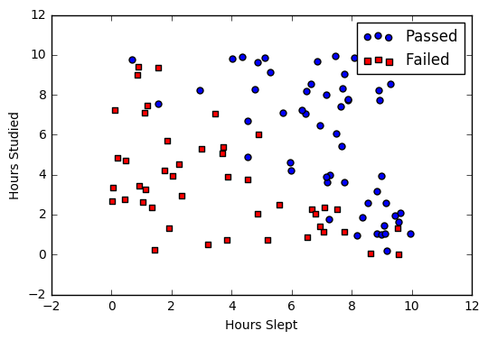
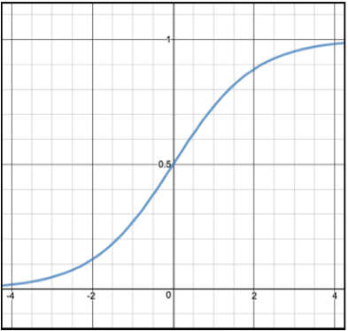
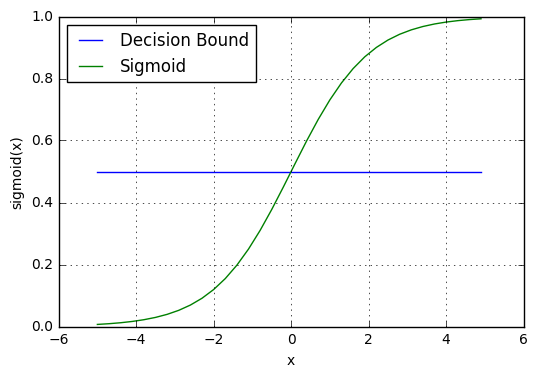
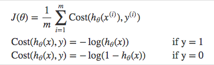
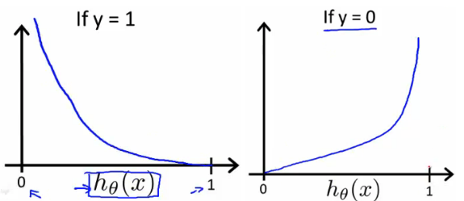
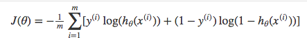
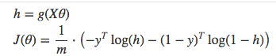
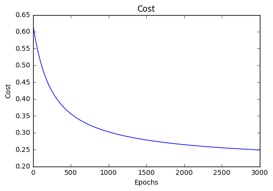
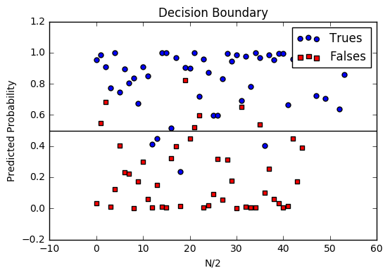

.. _logistic_regression:

===================
Logistic Regression
===================

.. contents:: :local:

Introduction
============

Logistic regression is a classification algorithm used to assign observations to a discrete set of classes. Unlike linear regression which outputs continuous number values, logistic regression transforms its output using the logistic sigmoid function to return a probability value which can then be mapped to two or more discrete classes.

Comparison to linear regression
-------------------------------

Given data on time spent studying and exam scores. :doc:`linear_regression` and logistic regression can predict different things:

  - **Linear Regression** could help us predict the student's test score on a scale of 0 - 100. Linear regression predictions are continuous (numbers in a range).

  - **Logistic Regression** could help use predict whether the student passed or failed. Logistic regression predictions are discrete (only specific values or categories are allowed). We can also view probability scores underlying the model's classifications, allowing us to understand the how 'confidently' the model predicts the classification of a data points.

Types of logistic regression
----------------------------

  - Binary Classification (Pass/Fail)
  - Multiple Classification (Cats, Dogs, Sheep)

Binary logistic regression
==========================

Say we're given `data <http://scilab.io/wp-content/uploads/2016/07/data_classification.csv>`_ on student exam results and our goal is to predict whether a student will pass or fail based on number of hours slept and hours spent studying. We have two features (hours slept, hours studied) and two classes: passed (1) and failed (0).

+--------------+-------------+-------------+
| **Studied**  | **Slept**   | **Passed**  |
+--------------+-------------+-------------+
| 4.85         | 9.63        | 1           |
+--------------+-------------+-------------+
| 8.62         | 3.23        | 0           |
+--------------+-------------+-------------+
| 5.43         | 8.23        | 1           |
+--------------+-------------+-------------+
| 9.21         | 6.34        | 0           |
+--------------+-------------+-------------+

Graphically we could represent our data with a scatter plot.

Sigmoid activation
------------------

In order to map predicted values to probabilities, we use the :ref:`sigmoid <activation_sigmoid>` function. The function maps any real value into another value between 0 and 1. In machine learning, we use sigmoid to map predictions to probabilities.

.. rubric:: Math

.. math::

  S(z) = \frac{1} {1 + e^{-z}}

.. note::

  - :math:`s(z)` = output between 0 and 1 (probability estimate)
  - :math:`z` = input to the function (your algorithm's prediction e.g. mx + b)
  - :math:`e` = base of natural log

.. rubric:: Graph

.. rubric:: Code

.. literalinclude:: ../code/activation_functions.py
    :language: python
    :pyobject: sigmoid

.. could potentially link to another file.. http://docutils.sourceforge.net/docs/ref/rst/directives.html#include

Decision boundary
-----------------

Our current prediction function returns a probability score between 0 and 1. In order to map this to a discrete class (true/false, cat/dog), we select a threshold value or tipping point above which we will classify values into class 1 and below which we classify values into class 2.

.. math::

  p \geq 0.5, class=1 \\
  p < 0.5, class=0

For example, if our threshold was .5 and our prediction function returned .7, we would classify this observation as positive. If our prediction was .2 we would classify the observation as negative. For logistic regression with multiple classes we could select the class with the highest predicted probability.

Making predictions
------------------

Using our knowledge of sigmoid functions and decision boundaries, we can now write a prediction function. A prediction function in logistic regression returns the probability of our observation being positive, True, or "Yes". We call this class 1 and its notation is :math:`P(class=1)`. As the probability gets closer to 1, our model is more confident that the observation is in class 1.

.. rubric:: Math

Let's use the same :ref:`multiple linear regression <multiple_linear_regression_predict>` equation from our linear regression tutorial.

.. math::

  z = W_0 + W_1 Studied + W_2 Slept

This time however we will transform the output using the sigmoid function to return a probability value between 0 and 1.

.. math::

  P(class=1) = \frac{1} {1 + e^{-z}}

If the model returns .4 it believes there is only a 40% chance of passing. If our decision boundary was .5, we would categorize this observation as "Fail.""

.. rubric:: Code

We wrap the sigmoid function over the same prediction function we used in :ref:`multiple linear regression <multiple_linear_regression_predict>`

.. literalinclude:: ../code/logistic_regression.py
    :language: python
    :pyobject: predict

Cost function
-------------

Unfortunately we can't (or at least shouldn't) use the same cost function :ref:`mse` as we did for linear regression. Why? There is a great math explanation in chapter 3 of Michael Neilson's deep learning book [5]_, but for now I'll simply say it's because our prediction function is non-linear (due to sigmoid transform). Squaring this prediction as we do in MSE results in a non-convex function with many local minimums. If our cost function has many local minimums, gradient descent may not find the optimal global minimum.

.. rubric:: Math

Instead of Mean Squared Error, we use a cost function called :ref:`loss_cross_entropy`, also known as Log Loss. Cross-entropy loss can be divided into two separate cost functions: one for :math:`y=1` and one for :math:`y=0`.

The benefits of taking the logarithm reveal themselves when you look at the cost function graphs for y=1 and y=0. These smooth monotonic functions [7]_ (always increasing or always decreasing) make it easy to calculate the gradient and minimize cost. Image from Andrew Ng's slides on logistic regression [1]_.

The key thing to note is the cost function penalizes confident and wrong predictions more than it rewards confident and right predictions! The corollary is increasing prediction accuracy (closer to 0 or 1) has diminishing returns on reducing cost due to the logistic nature of our cost function.

.. rubric:: Above functions compressed into one

Multiplying by :math:`y` and :math:`(1-y)` in the above equation is a sneaky trick that let's us use the same equation to solve for both y=1 and y=0 cases. If y=0, the first side cancels out. If y=1, the second side cancels out. In both cases we only perform the operation we need to perform.

.. rubric:: Vectorized cost function

.. rubric:: Code

.. literalinclude:: ../code/logistic_regression.py
    :language: python
    :pyobject: cost_function

Gradient descent
----------------

To minimize our cost, we use :doc:`gradient_descent` just like before in :doc:`linear_regression`. There are other more sophisticated optimization algorithms out there such as conjugate gradient like :ref:`optimizers_lbfgs`, but you don't have to worry about these. Machine learning libraries like Scikit-learn hide their implementations so you can focus on more interesting things!

.. rubric:: Math

One of the neat properties of the sigmoid function is its derivative is easy to calculate. If you're curious, there is a good walk-through derivation on stack overflow [6]_. Michael Neilson also covers the topic in chapter 3 of his book.

.. math::

  \begin{align}
  s'(z) & = s(z)(1 - s(z))
  \end{align}

Which leads to an equally beautiful and convenient cost function derivative:

.. math::

  C' = x(s(z) - y)

.. note::

  - :math:`C'` is the derivative of cost with respect to weights
  - :math:`y` is the actual class label (0 or 1)
  - :math:`s(z)` is your model's prediction
  - :math:`x` is your feature or feature vector.

Notice how this gradient is the same as the :ref:`mse` gradient, the only difference is the hypothesis function.

.. rubric:: Pseudocode

::

  Repeat {

    1. Calculate gradient average
    2. Multiply by learning rate
    3. Subtract from weights

  }

.. rubric:: Code

.. literalinclude:: ../code/logistic_regression.py
    :language: python
    :pyobject: update_weights

Mapping probabilities to classes
--------------------------------

The final step is assign class labels (0 or 1) to our predicted probabilities.

.. rubric:: Decision boundary

.. literalinclude:: ../code/logistic_regression.py
    :language: python
    :pyobject: decision_boundary

.. rubric:: Convert probabilities to classes

.. literalinclude:: ../code/logistic_regression.py
    :language: python
    :pyobject: classify

.. rubric:: Example output

::

  Probabilities = [ 0.967, 0.448, 0.015, 0.780, 0.978, 0.004]
  Classifications = [1, 0, 0, 1, 1, 0]

Training
--------

Our training code is the same as we used for :ref:`linear regression <simple_linear_regression_training>`.

.. literalinclude:: ../code/logistic_regression.py
    :language: python
    :pyobject: train

Model evaluation
----------------

If our model is working, we should see our cost decrease after every iteration.

::

  iter: 0 cost: 0.635
  iter: 1000 cost: 0.302
  iter: 2000 cost: 0.264

**Final cost:**  0.2487.  **Final weights:** [-8.197, .921, .738]

.. rubric:: Cost history

.. rubric:: Accuracy

:ref:`Accuracy <glossary_accuracy>` measures how correct our predictions were. In this case we simple compare predicted labels to true labels and divide by the total.

.. literalinclude:: ../code/logistic_regression.py
    :language: python
    :pyobject: accuracy

.. rubric:: Decision boundary

Another helpful technique is to plot the decision boundary on top of our predictions to see how our labels compare to the actual labels. This involves plotting our predicted probabilities and coloring them with their true labels.

.. rubric:: Code to plot the decision boundary

.. literalinclude:: ../code/logistic_regression.py
    :language: python
    :pyobject: plot_decision_boundary

Scipy example
-------------

Let's compare our performance to the ``LogisticRegression`` model provided by scikit-learn [8]_.

.. literalinclude:: ../code/logistic_regression_scipy.py

**Scikit score:**  0.88. **Our score:** 0.89

.. _multiclass_logistic_regression:

===============================
Multi-Class Logistic Regression
===============================

.. contents:: :local:

Introduction
------------

Next, we move onto a slightly more advanced multiclass logistic classification implementation using numpy's matrix algebra tools and a one-vs-all approach to enable extension to multi-class problems.

One-Versus-All Classification
-----------------------------

The logistic regression algorithm is inherently limited to binary classification. So to enable use of the algorithm for multi-class classification, we implement the one-versus-all approach. Simply put, the procedure is:

  #. Divide the problem into a set of binary classification problems, one for each unique value of y (each class)
  #. Then, for each class:
  #. Use a logistic regression to predict the probability that the observations are in that single class.
  #. prediction = max(softmax(probability of the classes))

The value of implementing the softmax function instead of simply taking the max of the predictions will be discussed further along in the document.

Problem Initialization
----------------------

In this case, we will be using the highly-studied Iris dataset as our training data. The iris dataset is commonly used to demonstrate the necessity of supervised classification, as it is clear from plotting the data that it is not clearly separable into three distinct clusters.

.. literalinclude:: ../code/multiclass_logistic_regression.py
    :language: python
    :pyobject: importIris

Although we cannot view the four-dimensional data all at once, we can split up the X data two dimensions at a time and still get a good idea of what the overall data clusters look like:

.. literalinclude:: ../code/multiclass_logistic_regression.py
    :language: python
    :pyobject: plotIris

.. image:: images/iris_scatter.png
    :align: center

Examining at the data, we should expect good performance at identifying the red flower type, as it is fairly easy to visualize a straight line separating the red type from the others on both the plots. However, we can expect more difficulty in separating the yellow and blue/gray flower types.

The y data takes the shape of a multi-class label vector:

+--------------+
| **Yval**     |
+--------------+
| 0            |
+--------------+
| 1            |
+--------------+
| 2            |
+--------------+
| 1            |
+--------------+

This needs to be converted into three y data sets (one for each flower type). We'll do this using numpy:

.. literalinclude:: ../code/multiclass_logistic_regression.py
    :language: python
    :pyobject: oneVsAll

This leaves the y data now as three binary y vectors, which we can assemble into a y matrix:

+--------------+-------------+-------------+
| **Y0**       | **Y1**      | **Y2**      |
+--------------+-------------+-------------+
| 1            | 0           | 0           |
+--------------+-------------+-------------+
| 0            | 1           | 0           |
+--------------+-------------+-------------+
| 0            | 0           | 1           |
+--------------+-------------+-------------+
| 1            | 0           | 0           |
+--------------+-------------+-------------+

Using the matrix algebra tools in numpy, we'll be building functions that look very similar to those in the binary logistic regression, but can handle all three models simultaneously. Additionally, we finish the initialization of the data structures by standardizing the X data, adding the bias feature, and generating an initial random guess for the weights vector for each of the three models.

.. literalinclude:: ../code/multiclass_logistic_regression.py
    :language: python
    :pyobject: initialize

Multiclass Logistic Regressor
-----------------------------

We'll quickly work through the code for the multiclass logistic regressors here, without too much detail as it is assumed that you've already learned the binary logistic regression in :doc:`logistic_regression`.

Sigmoid and Prediction
----------------------

To start, we implement code for a sigmoid function, the heart of the logistic regression:

.. literalinclude:: ../code/multiclass_logistic_regression.py
    :language: python
    :pyobject: sigmoid

The sigmoid is applied to modify the linear prediction model into a psuedo-probability that can be used as a classification criteria. By properly matching the dimesions of the X (150x5) and weight (3x5) vectors, this is handled for all three binary logistic regressors in a single line:

.. literalinclude:: ../code/multiclass_logistic_regression.py
    :language: python
    :pyobject: predict

Multiclass Decision boundary
----------------------------

Our current prediction function returns a probability score between 0 and 1 for each of the three models. To decide which class a data point should be labeled as, we apply a softmax function to the full set of y predictions. The softmax preserves the true max of the data, but also has the effect of the absolute value of the softmax being able to be interpreted as a 'confidence' of the model.

.. image:: images/softmax_math.png
    :align: center

.. literalinclude:: ../code/multiclass_logistic_regression.py
    :language: python
    :pyobject: softmaxClassifier

Thus we select the Logistic Regressor with the highest probability prediction as the 'True' classification, and use the actual softmax prediction as a way to quantify the confidence of the model's predictions if we so chose.

The softmax can be used as a 'confidence' because it will give a smaller answer if the guesses from the different models are of similar magnitude. So, for example, max(softmax([1,10,1]))=0.999, and max(softmax([1,2,1]))=0.576.

Cost function
-------------

Just as for the binary logistic regression, we use the cross entropy (a.k.a. log loss) cost function.

.. literalinclude:: ../code/multiclass_logistic_regression.py
    :language: python
    :pyobject: costFunction

Gradient descent
----------------

To minimize our cost, we use :doc:`gradient_descent` just like before in :doc:`logistic_regression`. The weights are updated in a step-wise fashion, as the negative of the gradient scaled by a learning rate.

.. literalinclude:: ../code/multiclass_logistic_regression.py
    :language: python
    :pyobject: cgStep

Accuracy
--------

The final metric of the success of our model is the accuracy of prediction, defined similarly to the binary problem, but using numpy tools to make the multiclass math easier:

.. literalinclude:: ../code/multiclass_logistic_regression.py
    :language: python
    :pyobject: accuracy

Training
--------

The training code is very similar to the code we used for :ref:`linear regression <simple_linear_regression_training>`. It iterates over the conjugate gradient steps, updating the weights and a record of the total cost and accuracy of the model as it goes.

.. literalinclude:: ../code/logistic_regression.py
    :language: python
    :pyobject: train

Model evaluation
----------------

If our model is working, we should see our cost decrease after every iteration, and should see our accuracy generally increase. Unlike the cost, however, the accuracy is not directly improved by the algorithm and may not necessarily improve with every iteration.

.. image:: images/multiclass_logistic_training.png
    :align: center

The final accuracy of about 81% isn't particularly great, but we already suspected that it would be difficult to separate this data with linear decision boundaries.

Using a function similar to plotIris(), we can make a custom plot to compare the results of the multiclass logistic regression and confirm our suspicions. Just like the plotIris() function, the color is mapped by the class label, and additionally for the predicted data the marker size directly corresponds to the confidence of the prediction- higher confidence leads to a larger marker size.

.. image:: images/multiclass_logistic_predict_versus_actual.png
    :align: center

The logistic regressor in this case struggles to accurately identify many of the data points, even misclassifying many of the data points that should correspond to the yellow flower type as red, possibly due to the model for the yellow flower type having low predictive values overall. The logistic regression also does a relatively poor job at capturing the 'fuzzy' boundary of the yellow and blue/gray clusters. In general the model is about 50% more confident at classifying the data on the edges compared to the data in the center of the overall dataset, and the origins of the low accuracy are clearly coming from the central region.

.. rubric:: References

.. [1] http://www.holehouse.org/mlclass/06_Logistic_Regression.html
.. [2] http://machinelearningmastery.com/logistic-regression-tutorial-for-machine-learning
.. [3] https://scilab.io/machine-learning-logistic-regression-tutorial/
.. [4] https://github.com/perborgen/LogisticRegression/blob/master/logistic.py
.. [5] http://neuralnetworksanddeeplearning.com/chap3.html
.. [6] http://math.stackexchange.com/questions/78575/derivative-of-sigmoid-function-sigma-x-frac11e-x
.. [7] https://en.wikipedia.org/wiki/Monotoniconotonic_function
.. [8] http://scikit-learn.org/stable/modules/linear_model.html#logistic-regression>
