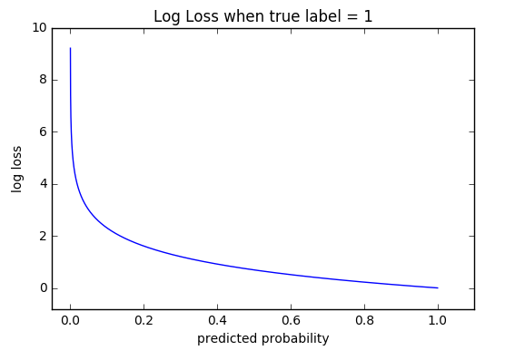
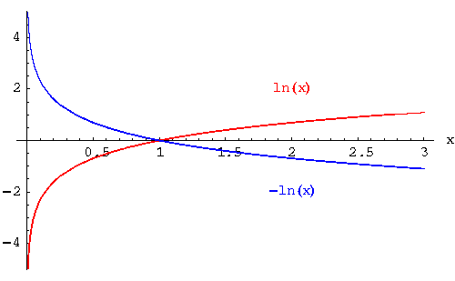

.. _loss_functions:

==============
Loss functions
==============

Metrics used to quantify how "good" or "bad" our model is at making predictions. The smaller the loss, the better our model (unless we overfit).

Cross-Entropy Loss
==================

Cross-Entropy Loss (or Log Loss) measures the performance of a classification model where the prediction input is a probability value between 0 and 1. The model's goal is to minimize this value. A perfect model would have a log loss of 0. Cross-entropy loss increases as the predicted probability diverges from the actual label. So predicting a probability of .012 when the actual observation label is 1 would be bad and result in a high loss value.

The graph below shows the range of possible loss values given a true observation (isDog = 1). As the predicted probability approaches 1, log loss slowly decreases. As the predicted probability decreases, however, the log loss increases rapidly. Log loss penalizes both types of errors, but especially those predications that are confident and wrong!

.. note::

  Cross-entropy and log loss are slightly different depending on context, but in machine learning when calculating error rates between 0 and 1 they resolve to the same thing.

Code
----

To calculate log loss from scratch, we need to include the MinMax function (see below). Numpy implements this for us with np.clip().

::

  def logloss(true_label, predicted, eps=1e-15):
    p = np.clip(predicted, eps, 1 - eps)
    if true_label == 1:
      return -log(p)
    else:
      return -log(1 - p)

Math
----

The equations below demonstrate how to calculate cross-entropy loss for a single observation. When evaluating a model against a dataset, your log loss score is simply the average log loss across all observations.

.. note::

  * N - number of observations
  * M - number of possible class labels (dog, cat, fish)
  * log - the natural logarithm
  * y - a binary indicator (0 or 1) of whether class label :math:`c` is the correct classification for observation :math:`o`
  * p - the model's predicted probability that observation :math:`o` is of class :math:`c`

Binary Classification
---------------------

In binary classification (M=2), the formula equals:

.. math::

  -{(y\log(p) + (1 - y)\log(1 - p))}

For example, given a class label of 1 and a predicted probability of .25, using the formula above we can calculate the loss:

.. math::

  \begin{align}
  loss & = -{(1\log(.25) + (1 - 1)\log(1 - .25))} \\
       & = -{(\log(.25) + 0\log(.75))} \\
       & = -{\log(.25)}
  \end{align}

Similarly given a class label of 0 and a predicted probability of .25, we can calculate log loss as:

.. math::

  \begin{align}
  loss & = -{(0\log(.25) + (1 - 0)\log(0 - .25))} \\
       & = -{(1\log(-.25))} \\
       & = -{\log(-.25)}
  \end{align}

In Python we can express this even more simply:

::

  def loss(true_label, predicted_prob):
    if true_label == 1:
      return -log(predicted_prob)
    else:
      return -log(1 - predicted_prob)

Multi-class Classification
--------------------------

In multi-class classification (M>2), we take the sum of loss values for each class prediction in the observation.

.. math::

  -\sum_{c=1}^My_{o,c}\log(p_{o,c})

.. note::

  :math:`\sum` is shorthand for summation or in our case the sum of all loss values across classes
  :math:`c=1` is the starting point in the summation (i.e. the first class)

Why the Negative Sign?
----------------------
Cross-entropy takes the negative log to provide an easy metric for comparison. It takes this approach because the positive log of numbers < 1 returns negative values, which is confusing to work with when comparing the performance of two models.

MinMax Rule
-----------

When calculating log loss using the formulas above, predicted input values of 0 and 1 are undefined. To avoid this problem, log loss functions typically adjust the predicted probabilities :math:`p` by a small value (epsilon).

.. math::

  max(min(p, 1−10^−15), 10^-15)

Here are some examples:

**p = 0**

  #. Apply min function (0 is smaller than 1 - 1e-15 --> 0)
  #. Apply max function (1e-15 is larger than 0 --> 1e-15)
  #. Thus, our submitted probability of 0 is converted to 1e-15 (~0.0000000000000001)

**p = 1**

  #. Apply min function (1 - 1e-15 is smaller than 1 --> 1 - 1e-15 (~0.9999999999999999)
  #. Apply max function (1 - 1e-15 is larger than 1e-15 —> 1 - 1e-15 (~0.9999999999999999))
  #. Thus, our submitted probability of 1 is converted to 1 - 1e-15 (~0.9999999999999999)

.. rubric:: References

- https://en.m.wikipedia.org/wiki/Cross_entropy
- https://www.kaggle.com/wiki/LogarithmicLoss
- https://en.wikipedia.org/wiki/Loss_functions_for_classification
- http://www.exegetic.biz/blog/2015/12/making-sense-logarithmic-loss/
- http://neuralnetworksanddeeplearning.com/chap3.html#the_cross-entropy_cost_function

Hinge Loss
==========

Be the first to contribute!

Kullback-Leibler divergence
===========================

Be the first to contribute!

L1 Loss
=======

Be the first to contribute!

L2 Loss
=======

Be the first to contribute!

Maximum Likelihood
==================

Be the first to contribute!

Mean Squared Error
==================

Description of MSE.

.. literalinclude:: ../code/loss_functions.py
    :language: python
    :pyobject: MSE

**Derivative**

.. literalinclude:: ../code/loss_functions.py
    :language: python
    :pyobject: MSE_prime

**References**

* http://rishy.github.io/ml/2015/07/28/l1-vs-l2-loss/
