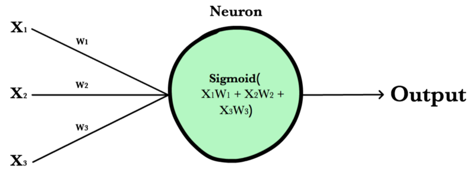
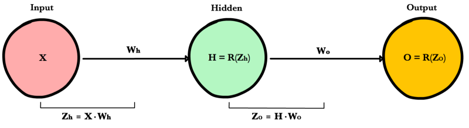
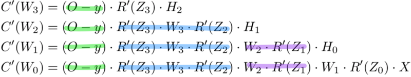
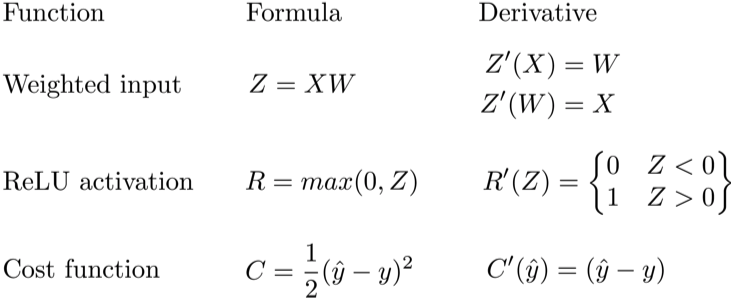
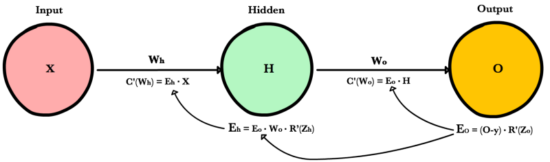

.. _nn_concepts:

.. toctree::
  :maxdepth: 1
  :titlesonly:

========
Concepts
========

Basic concepts in neural networks

Neuron
======

A neuron takes a group of weighted inputs, applies an activation function, and returns an output.

Inputs to a neuron can either be features from a training set or outputs from a previous layer’s neurons. Weights are applied to the inputs as they travel along synapses to reach the neuron. The neuron then applies an activation function to the “sum of weighted inputs” from each incoming synapse and passes the result on to all the neurons in the next layer.

Synapse
=======

Synapses are like roads in a neural network. They connect inputs to neurons, neurons to neurons, and neurons to outputs. In order to get from one neuron to another, you have to travel along the synapse paying the “toll” (weight) along the way. Each connection between two neurons has a unique synapse with a unique weight attached to it. When we talk about updating weights in a network, we’re really talking about adjusting the weights on these synapses.

Parameters
==========

  * **Weights** - Explanation of weights and biases(parameters)

  * **Bias** - Bias terms are additional constants attached to neurons and added to the weighted input before the activation function is applied. A more detailed explanation of :ref:`bias_term` is available in the glossary.

Layers
======

.. image:: images/neural_network_simple.png
    :align: center

.. rubric:: Input Layer

Holds the data your model will train on. Each neuron in the input layer represents a unique attribute in your dataset (e.g. height, hair color, etc.).

.. rubric:: Hidden Layer

Sits between the input and output layers and applies an activation function before passing on the results. There are often multiple hidden layers in a network. In traditional networks, hidden layers are typically fully-connected layers — each neuron receives input from all the previous layer’s neurons and sends its output to every neuron in the next layer. This contrasts with how convolutional layers work where the neurons send their output to only some of the neurons in the next layer.

.. rubric:: Output Layer

The final layer in a network. It receives input from the previous hidden layer, optionally applies an activation function, and returns an output representing your model’s prediction.

Weighted Input
==============

A neuron’s input equals the sum of weighted outputs from all neurons in the previous layer. Each input is multiplied by the weight associated with the synapse connecting the input to the current neuron. If there are 3 inputs or neurons in the previous layer, each neuron in the current layer will have 3 distinct weights — one for each each synapse.

**Single Input**

.. math::

  Z &= Input \cdot Weight \\
    &= X W

**Multiple Inputs**

.. math::

  Z &= \sum_{i=1}^{n}x_i w_i \\
    &= x_1 w_1 + x_2 w_2 + x_3 w_3

Notice, it’s exactly the same equation we use with linear regression! In fact, a neural network with a single neuron is the same as linear regression! The only difference is the neural network post-processes the weighted input with an activation function.

Activation Functions
====================

Activation functions live inside neurons and modify the data they receive before passing it to the next layer. Activation functions give neural networks their power — allowing them to model complex non-linear relationships. By modifying inputs with non-linear functions neural networks can model highly complex relationships between features. Popular activation functions include :ref:`relu` and :ref:`sigmoid`.

Activation functions typically have the following properties:

  * **Non-linear** - In linear regression we’re limited to a prediction equation that looks like a straight line. This is nice for simple datasets with a one-to-one relationship between inputs and outputs, but what if the patterns in our dataset were non-linear? (e.g. :math:`x^2`, sin, log). To model these relationships we need a non-linear prediction equation.¹ Activation functions provide this non-linearity.

  * **Continuously differentiable** — To improve our model with gradient descent, we need our output to have a nice slope so we can compute error derivatives with respect to weights. If our neuron instead outputted 0 or 1 (perceptron), we wouldn’t know in which direction to update our weights to reduce our error.

  * **Fixed Range** — Activation functions typically squash the input data into a narrow range that makes training the model more stable and efficient.

Loss Functions
==============

Be the first to contribute!

Forwardprop
===========

.. image:: images/neural_network_simple.png
    :align: center

Forward propagation is how neural networks make predictions. Input data is "forward propagated" through the network layer by layer to the final layer which outputs a prediction. For the toy neural network above, a single pass of forward propagation translates mathematically to:

.. math::

  Prediction = A(\;A(X W_h)W_o\;)

Where :math:`A` is an activation function like :ref:`relu`, :math:`X` is the input and :math:`W_h` and :math:`W_o` are weights.

First, we calculate the input to the hidden layer by multiplying :math:`X` by the hidden weight :math:`W_h`. Next, we apply the activation function and pass the result to the final layer, where the process is repeated except this time :math:`X` is replaced by the hidden layer's output, :math:`H`.

.. rubric:: Feed forward code

Let’s write a method feed_forward() to propagate input data through our simple network of 1 hidden layer. The output of this method represents our model’s prediction.

.. literalinclude:: ../code/nn_simple.py
    :language: python
    :lines: 4-15

``x`` is the input to the network, ``Zo`` and ``Zh`` are the weighted inputs and ``Wo`` and ``Wh`` are the weights.

..    :pyobject: MyClass   #Target a specific class.function in a file

Backprop
========

The goals of backpropagation are straightforward: adjust each weight in the network in proportion to how much it contributes to overall error. If we iteratively reduce each weight's error, eventually we’ll have a series of weights the produce good predictions.

.. rubric:: Chain rule basics

As seen above, foward propagation can be viewed as a long series of nested equations. If you think of feed forward this way, then backpropagation is merely an application the :ref:`chain_rule` to find the :ref:`derivative` of cost with respect to any variable in the nested equation. Given a forward propagation function:

.. math::

  f(x) = A(B(C(x)))

A, B, and C are activation functions at different layers. Using the chain rule we easily calculate the derivative of :math:`f(x)` with respect to :math:`x`:

.. math::

  f'(x) = f'(A) \cdot A'(B) \cdot B'(C) \cdot C'(x)

How about the derivative with respect to B? To find the derivative with respect to B you can pretend :math:`B(C(x))` is a constant, replace it with a placeholder variable B, and proceed to find the derivative normally with respect to B.

.. math::

  f'(B) = f'(A) \cdot A'(B)

This simple technique extends to any variable within a function and allows us to precisely pinpoint the exact impact each variable has on the total output.

.. rubric::  Applying the chain rule

Let's use the chain rule to calculate the derivative of cost with respect to any weight in the network. The chain rule will help us identify how much each weight contributes to our overall error and the direction to update each weight to reduce our error. Here are the equations we need to make a prediction and calculate total error, or cost:

.. image:: images/backprop_ff_equations.png
    :align: center

Given a network consisting of a single neuron, total cost could be calculated as:

.. math::

  Cost = C(R(Z(X W)))

Using the chain rule we can easily find the derivative of Cost with respect to weight W.

.. math::

  C'(W) &= C'(R) \cdot R'(Z) \cdot Z'(W) \\
        &= (\hat y -y) \cdot R'(Z) \cdot X

Now that we have an equation to calculate the derivative of cost with respect to any weight, let's go back to our toy neural network example above

What is the derivative of cost with respect to :math:`W_o`?

.. math::

  C'(W_O) &= C'(O) \cdot O'(Z_O) \cdot Z_O'(W_O) \\
          &= (O - y) \cdot R'(Z_O) \cdot H

And how about with respect to :math:`W_h`? To find out we just keep going further back in our function applying the chain rule recursively until we get to the function that has the Wh term.

.. math::

  C'(W_h) &= C'(O) \cdot O'(Z_o) \cdot Z_o'(H) \cdot H'(Z_h) \cdot Z_h'(W_h) \\
          &= (O - y) \cdot R'(Z_o) \cdot W_o \cdot R'(Z_h) \cdot X

And just for fun, what if our network had 10 hidden layers. What is the derivative of cost for the first weight :math:`w_1`?

.. math::

  C'(w_1) = \frac{dC}{dO} \cdot \frac{dO}{dZ_{11}} \cdot \frac{dZ_{11}}{dH_{10}} \cdot \\ \frac{dH_{10}}{dZ_{10}} \cdot \frac{dZ_{10}}{dH_9} \cdot \frac{dH_9}{dZ_9} \cdot \frac{dZ_9}{dH_8} \cdot \frac{dH_8}{dZ_8} \cdot \frac{dZ_8}{dH_7} \cdot \frac{dH_7}{dZ_7} \cdot \\ \frac{dZ_7}{dH_6} \cdot \frac{dH_6}{dZ_6} \cdot \frac{dZ_6}{dH_5} \cdot \frac{dH_5}{dZ_5} \cdot \frac{dZ_5}{dH_4} \cdot \frac{dH_4}{dZ_4} \cdot \frac{dZ_4}{dH_3} \cdot \\ \frac{dH_3}{dZ_3} \cdot \frac{dZ_3}{dH_2} \cdot \frac{dH_2}{dZ_2} \cdot \frac{dZ_2}{dH_1} \cdot \frac{dH_1}{dZ_1} \cdot \frac{dZ_1}{dW_1}

See the pattern? The number of calculations required to compute cost derivatives increases as our network grows deeper. Notice also the redundancy in our derivative calculations. Each layer's cost derivative appends two new terms to the terms that have already been calculated by hte layers above it.

.. rubric:: Saving work with Memoization

Memoization is a computer science term which simply means: don’t recompute the same thing over and over. In memoization we store previously computed results to avoid recalculating the same function. It's handy for speeding up recursive functions of which backpropagation is one. Notice the pattern in the derivative equations below.

Each of these layers is recomputing the same derivatives! Instead of writing out long derivative equations for every weight, we can use memoization to save our work as we backprop error through the network. To do this, we define 3 equations (below), which together encapsulate all the calculations needed for backpropagation. The math is the same, but the equations provide a nice shorthand we can use to track which calculations we've already performed and save our work as we move backwards through the network.

We first calculate the output layer error and pass the result to the hidden layer before it. After calculating the hidden layer error, we pass its error value back to the previous hidden layer before it. And so on and so forth. As we move back through the network we apply the 3rd formula at every layer to calculate the derivative of cost with respect that layer's weights. This resulting derivative tells us in which direction to adjust our weights to reduce overall cost.

.. note::

  The term *layer error* refers to the derivative of cost with respect to a layer's *input*. It answers the question: how does the cost function output change when the input to that layer changes?

.. rubric:: Output layer error

To calculate output layer error we need to find the derivative of cost with respect to the output layer input, :math:`Z_o`. It answers the question — how are the final layer's weights impacting overall error in the network? The derivative is then:

.. math::

  C'(Z_o) = (O - y) \cdot R'(Z_o)

To simplify notation, ml practitioners typically replace the :math:`(O-y) * R'(Zo)` sequence with the term :math:`E_o`. So our formula for output layer error equals:

.. math::

  E_o = (O - y) \cdot R'(Z_o)

.. rubric:: Hidden layer error

To calculate hidden layer error we need to find the derivative of cost with respect to the hidden layer input, Zh. 

.. math::

  C'(Z_h) = (O - y) \cdot R'(Z_o) \cdot W_o \cdot R'(Z_h)

Next we can swap in the :math:`E_o` term above to avoid duplication and create a new simplified equation for Hidden layer error:

.. math::

  E_h = E_o \cdot W_o \cdot R'(Z_h)

This formula is at the core of backpropagation. We calculate the current layer's error, and pass the weighted error back to the previous layer, continuing the process until we arrive at our first hidden layer. Along the way we update the weights using the derivative of cost with respect to each weight.

.. rubric:: Derivative of cost with respect to any weight

Let’s return to our formula for the derivative of cost with respect to the output layer weight :math:`W_o`. 

.. math::

  C'(W_O) = (O - y) \cdot R'(Z_O) \cdot H

We know we can replace the first part with our equation for output layer error :math:`E_h`. H represents the hidden layer activation.

.. math::

  C'(W_o) = E_o \cdot H

So to find the derivative of cost with respect to any weight in our network, we simply multiply the cooresponding layer's error times its input (the previous layer's output).

.. math::

  C'(w) = CurrentLayerError \cdot CurrentLayerInput

.. note::

  *Input* refers to the activation from the previous layer, not the weighted input, Z.

So to summarize, here is the backpropagation process for our toy neural network.

.. rubric:: Backpropagation code

.. literalinclude:: ../code/nn_simple.py
    :language: python
    :lines: 17-41

