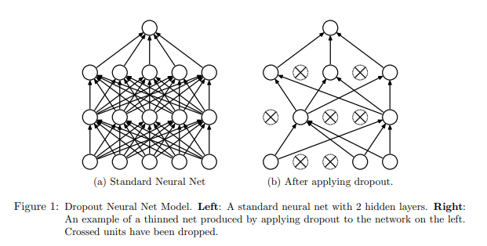
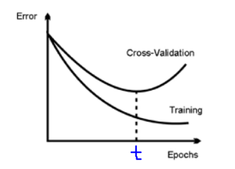

.. _regularization:

==============
Regularization
==============

.. contents:: :local:

.. rubric:: What is overfitting?

From Wikipedia `overfitting <https://en.wikipedia.org/wiki/Overfitting>`__ is, 

The production of an analysis that corresponds too closely or exactly to a particular set 
of data, and may therefore fail to fit additional data or predict future observations 
reliably

.. rubric:: What is Regularization?

It is a Techniques for combating overfitting and improving training.

Data Augmentation
=================

Having more data (dataset / samples) is a best way to get better consistent estimators (ML model). In the real world getting a large volume of useful data for training a model is cumbersome and labelling is an extremely tedious task. 

Either labelling requires more manual annotation, example - For creating a better image classifier we can use Mturk and involve more man power to generate dataset or doing survey in social media and asking people to participate and generate dataset.  
Above process can yield good dataset however those are difficult to carry and expensive.  Having small dataset will lead to the well know Over fitting problem.  

Data Augmentation is one of the interesting regularization technique to resolve the above problem. The concept is very simple, this technique generates new training data from given original dataset. Dataset Augmentation provides a cheap and easy way to
increase the amount of your training data.

This technique can be used for both NLP and CV. 

In CV we can use the techniques like Jitter, PCA and Flipping. Similarly in NLP we can use the techniques like Synonym Replacement,Random Insertion, Random Deletion and Word Embeddings. 

It is worth knowing that Keras' provided ImageDataGenerator for generating Data Augmentation. 

Sample code for random deletion

.. code-block:: python

	def random_deletion(words, p):
		"""
		Randomly delete words from the sentence with probability p
		"""
		
		#obviously, if there's only one word, don't delete it
		if len(words) == 1:
			return words

		#randomly delete words with probability p
		new_words = []
		for word in words:
			r = random.uniform(0, 1)
			if r > p:
				new_words.append(word)

		#if you end up deleting all words, just return a random word
		if len(new_words) == 0:
			rand_int = random.randint(0, len(words)-1)
			return [words[rand_int]]

		return new_words
	

Furthermore, when comparing two machine learning algorithms train both with either augmented or non-augmented dataset. Otherwise, no subjective decision can be made on which algorithm performed better

.. rubric:: Further reading

- `NLP Data Augmentation <https://arxiv.org/abs/1901.11196>`_
- `CV Data Augmentation <https://arxiv.org/abs/1904.12848>`_
- `Regularization <http://wavelab.uwaterloo.ca/wp-content/uploads/2017/04/Lecture_3.pdf>`_

Dropout
=======

.. rubric:: What is Dropout? 

Dropout is a regularization technique for reducing overfitting in neural networks by preventing complex co-adaptations on training data

Dropout is a technique where randomly selected neurons are ignored during training. They are “dropped-out” randomly. This means that their contribution to the activation of downstream neurons is temporally removed on the forward pass and any weight updates are not applied to the neuron on the backward pass.

Simply put, It is the process of ignoring some of the neurons in particular forward or backward pass. 

Dropout can be easily implemented by randomly selecting nodes to be dropped-out with a given probability (e.g. .1%) each weight update cycle. 

Most importantly Dropout is only used during the training of a model and is not used when evaluating the model. 

image from `<https://www.cs.toronto.edu/~hinton/absps/JMLRdropout.pdf>`_

.. code-block:: python

  import numpy as np 
  A = np.arange(20).reshape((5,4))

  print("Given input: ")
  print(A)

  def dropout(X, drop_probability):
      keep_probability = 1 - drop_probability
      mask = np.random.uniform(0, 1.0, X.shape) < keep_probability
      if keep_probability > 0.0:
          scale = (1/keep_probability)
      else:
          scale = 0.0
      return mask * X * scale

  print("\n After Dropout: ")
  print(dropout(A,0.5))

output from above code

.. code-block:: python

  Given input: 
  [[ 0  1  2  3]
  [ 4  5  6  7]
  [ 8  9 10 11]
  [12 13 14 15]
  [16 17 18 19]]

  After Dropout: 
  [[ 0.  2.  0.  0.]
  [ 8.  0.  0. 14.]
  [16. 18.  0. 22.]
  [24.  0.  0.  0.]
  [32. 34. 36.  0.]]

.. rubric:: Further reading
- Dropout `<https://www.cs.toronto.edu/~hinton/absps/JMLRdropout.pdf>`_

Early Stopping
==============

One of the biggest problem in training neural network is how long to train the model.

Training too little will lead to underfit in train and test sets. Traning too much will have the overfit in training set and poor result in test sets.

Here the challenge is to train the network long enough that it is capable of learning the mapping from inputs to outputs, but not training the model so long that it overfits the training data.

One possible solution to solve this problem is to treat the number of training epochs as a hyperparameter and train the model multiple times with different values, then select the number of epochs that result in the best accuracy on the train or a holdout test dataset, But the problem is it requires multiple models to be trained and discarded. 

Clearly, after ‘t’ epochs, the model starts overfitting. This is clear by the increasing gap between the train and the validation error in the above plot.

One alternative technique to prevent overfitting is use validation error to decide when to stop. This approach is called Early Stopping.

While building the model, it is evaluated on the holdout validation dataset after each epoch. If the accuracy of the model on the validation dataset starts to degrade (e.g. loss begins to increase or accuracy begins to decrease), then the training process is stopped. This process is called Early stopping. 

Python implementation for Early stopping, 

.. code-block:: python

  def early_stopping(theta0, (x_train, y_train), (x_valid, y_valid), n = 1, p = 100):
    """ The early stopping meta-algorithm for determining the best amount of time to train.
        REF: Algorithm 7.1 in deep learning book.
  
        Parameters:
        n: int; Number of steps between evaluations.
        p: int; "patience", the number of evaluations to observe worsening validataion set.
        theta0: Network; initial network.
        x_train: iterable; The training input set.
        y_train: iterable; The training output set.
        x_valid: iterable; The validation input set.
        y_valid: iterable; The validation output set.
          
        Returns:
        theta_prime: Network object; The output network.
        i_prime: int; The number of iterations for the output network.
        v: float; The validation error for the output network.
    """
    # Initialize variables
    theta = theta0.clone()       # The active network
    i = 0                        # The number of training steps taken
    j = 0                        # The number of evaluations steps since last update of theta_prime
    v = np.inf                   # The best evaluation error observed thusfar
    theta_prime = theta.clone()  # The best network found thusfar
    i_prime = i                  # The index of theta_prime

    while j < p:
        # Update theta by running the training algorithm for n steps
        for _ in range(n):
            theta.train(x_train, y_train)

        # Update Values
        i += n
        v_new = theta.error(x_valid, y_valid)

        # If better validation error, then reset waiting time, save the network, and update the best error value
        if v_new < v:
            j = 0
            theta_prime = theta.clone()
            i_prime = i
            v = v_new

        # Otherwise, update the waiting time
        else:
            j += 1

    return theta_prime, i_prime, v

.. rubric:: Further reading

- `Regularization <http://wavelab.uwaterloo.ca/wp-content/uploads/2017/04/Lecture_3.pdf>`_

Ensembling
==========

Ensemble methods combine several machine learning techniques into one predictive model. There are a few different methods for ensembling, but the two most common are:

.. rubric:: Bagging

- Bagging stands for bootstrap aggregation. One way to reduce the variance of an estimate is to average together multiple estimates.
- It trains a large number of "strong" learners in parallel.
- A strong learner is a model that's relatively unconstrained.
- Bagging then combines all the strong learners together in order to "smooth out" their predictions.

.. rubric:: Boosting

- Boosting refers to a family of algorithms that are able to convert weak learners to strong learners.
- Each one in the sequence focuses on learning from the mistakes of the one before it.
- Boosting then combines all the weak learners into a single strong learner.

Bagging uses complex base models and tries to "smooth out" their predictions, while boosting uses simple base models and tries to "boost" their aggregate complexity.

Injecting Noise
===============

Noise is often introduced to the inputs as a dataset augmentation strategy. When we have a small dataset the network may effectively memorize the training dataset. Instead of learning a general mapping from inputs to outputs, the model may learn the specific input examples and their associated outputs. One approach for improving generalization error and improving the structure of the mapping problem is to add random noise.

Adding noise means that the network is less able to memorize training samples because they are changing all of the time, resulting in smaller network weights and a more robust network that has lower generalization error.

Noise is only added during training. No noise is added during the evaluation of the model or when the model is used to make predictions on new data.

Random noise can be added to other parts of the network during training. Some examples include:

.. rubric:: Noise Injection on Weights

- Noise added to weights can be interpreted as a more traditional form of regularization.

- In other words, it pushes the model to be relatively insensitive to small variations in the weights, finding points that are not merely minima, but minima surrounded by flat regions.
	
.. rubric:: Noise Injection on Outputs

- In the real world dataset, We can expect some amount of mistakes in the output labels.  One way to remedy this is to explicitly model the noise on labels. 
	
- An example for Noise Injection on Outputs is **label smoothing**

.. rubric:: Further reading

- `Regularization <http://wavelab.uwaterloo.ca/wp-content/uploads/2017/04/Lecture_3.pdf>`_

L1 Regularization
=================

A regression model that uses L1 regularization technique is called *Lasso Regression*. 

.. rubric:: Mathematical formula for L1 Regularization. 

Let's define a model to see how L1 Regularization works. For simplicity, We define a simple linear regression model Y with one independent variable. 

In this model, W represent Weight, b represent Bias. 

.. math::

  W = w_1, w_2 . . . w_n
  
  X = x_1, x_2 . . . x_n

and the predicted result is :math:`\widehat{Y}` 

.. math::

  \widehat{Y} =  w_1x_1 +  w_2x_2 + . . . w_nx_n + b
 
Following formula calculates the error without Regularization function
  
.. math::

  Loss = Error(Y , \widehat{Y})
  
Following formula calculates the error With L1 Regularization function
  
.. math::

  Loss = Error(Y - \widehat{Y}) + \lambda \sum_1^n |w_i|
  
.. note:: 
	
	Here, If the value of lambda is Zero then above Loss function becomes Ordinary Least Square whereas very large value makes the coefficients (weights) zero hence it under-fits. 

One thing to note is that :math:`|w|` is differentiable when w!=0 as shown below, 

.. math::

  \frac{\text{d}|w|}{\text{d}w} = \begin{cases}1 & w > 0\\-1 & w < 0\end{cases}
  
To understand the Note above, 

Let's substitute the formula in finding new weights using Gradient Descent optimizer. 

.. math::

   w_{new} = w - \eta\frac{\partial L1}{\partial w}
   
When we apply the L1 in above formula it becomes, 

.. math::

   w_{new} = w - \eta. (Error(Y , \widehat{Y}) + \lambda\frac{\text{d}|w|}{\text{d}w})
           
           = \begin{cases}w - \eta . (Error(Y , \widehat{Y}) +\lambda) & w > 0\\w - \eta . (Error(Y , \widehat{Y}) -\lambda) & w < 0\end{cases}
 
From the above formula, 

- If w is positive, the regularization parameter :math:`\lambda` > 0 will push w to be less positive, by subtracting :math:`\lambda` from w. 
- If w is negative, the regularization parameter :math:`\lambda` < 0 will push w to be less negative, by adding :math:`\lambda` to w.  hence this has the effect of pushing w towards 0. 

Simple python implementation

.. code-block:: python

   def update_weights_with_l1_regularization(features, targets, weights, lr,lambda):
        '''
        Features:(200, 3)
        Targets: (200, 1)
        Weights:(3, 1)
        '''
        predictions = predict(features, weights)

        #Extract our features
        x1 = features[:,0]
        x2 = features[:,1]
        x3 = features[:,2]

        # Use matrix cross product (*) to simultaneously
        # calculate the derivative for each weight
        d_w1 = -x1*(targets - predictions)
        d_w2 = -x2*(targets - predictions)
        d_w3 = -x3*(targets - predictions)

        # Multiply the mean derivative by the learning rate
        # and subtract from our weights (remember gradient points in direction of steepest ASCENT)
        
        weights[0][0] = (weights[0][0] - lr * np.mean(d_w1) - lambda) if weights[0][0] > 0 else (weights[0][0] - lr * np.mean(d_w1) + lambda)
        weights[1][0] = (weights[1][0] - lr * np.mean(d_w2) - lambda) if weights[1][0] > 0 else (weights[1][0] - lr * np.mean(d_w2) + lambda)
        weights[2][0] = (weights[2][0] - lr * np.mean(d_w3) - lambda) if weights[2][0] > 0 else (weights[2][0] - lr * np.mean(d_w3) + lambda)
        
        return weights

.. rubric:: Use Case

L1 Regularization (or varient of this concept) is a model of choice when the number of features are high, Since it provides sparse solutions. We can get computational advantage as the features with zero coefficients can simply be ignored.

.. rubric:: Further reading

- `Linear Regression  <https://ml-cheatsheet.readthedocs.io/en/latest/linear_regression.html>`_

L2 Regularization
=================

A regression model that uses L2 regularization technique is called *Ridge Regression*. Main difference between L1 and L2 regularization is, L2 regularization uses “squared magnitude” of coefficient as penalty term to the loss function. 

.. rubric:: Mathematical formula for L2 Regularization. 

Let's define a model to see how L2 Regularization works. For simplicity, We define a simple linear regression model Y with one independent variable. 

In this model, W represent Weight, b represent Bias. 

.. math::

  W = w_1, w_2 . . . w_n
  
  X = x_1, x_2 . . . x_n

and the predicted result is :math:`\widehat{Y}` 

.. math::

  \widehat{Y} =  w_1x_1 +  w_2x_2 + . . . w_nx_n + b
 
Following formula calculates the error without Regularization function
  
.. math::

  Loss = Error(Y , \widehat{Y})
  
Following formula calculates the error With L2 Regularization function
  
.. math::

  Loss = Error(Y - \widehat{Y}) +  \lambda \sum_1^n w_i^{2}
  
.. note:: 
	
	Here, if lambda is zero then you can imagine we get back OLS. However, if lambda is very large then it will add too much weight and it leads to under-fitting.

	
To understand the Note above, 

Let's substitute the formula in finding new weights using Gradient Descent optimizer. 

.. math::

   w_{new} = w - \eta\frac{\partial L2}{\partial w}
   
When we apply the L2 in above formula it becomes, 

.. math::

     w_{new} = w - \eta. (Error(Y , \widehat{Y}) + \lambda\frac{\partial L2}{\partial w})
           
             = w - \eta . (Error(Y , \widehat{Y}) +2\lambda w) 
  
Simple python implementation

.. code-block:: python

   def update_weights_with_l2_regularization(features, targets, weights, lr,lambda):
        '''
        Features:(200, 3)
        Targets: (200, 1)
        Weights:(3, 1)
        '''
        predictions = predict(features, weights)

        #Extract our features
        x1 = features[:,0]
        x2 = features[:,1]
        x3 = features[:,2]

        # Use matrix cross product (*) to simultaneously
        # calculate the derivative for each weight
        d_w1 = -x1*(targets - predictions)
        d_w2 = -x2*(targets - predictions)
        d_w3 = -x3*(targets - predictions)

        # Multiply the mean derivative by the learning rate
        # and subtract from our weights (remember gradient points in direction of steepest ASCENT)
        
        weights[0][0] = weights[0][0] - lr * np.mean(d_w1) - 2 * lambda * weights[0][0]
        weights[1][0] = weights[1][0] - lr * np.mean(d_w2) - 2 * lambda * weights[1][0]
        weights[2][0] = weights[2][0] - lr * np.mean(d_w3) - 2 * lambda * weights[2][0]
        
        return weights

.. rubric:: Use Case

L2 regularization can address the multicollinearity problem by constraining the coefficient norm and keeping all the variables. L2 regression can be used to estimate the predictor importance and penalize predictors that are not important. One issue with co-linearity is that the variance of the parameter estimate is huge. In cases where the number of features are greater than the number of observations, the matrix used in the OLS may not be invertible but Ridge Regression enables this matrix to be inverted.

.. rubric:: Further reading

- `Ridge Regression  <https://en.wikipedia.org/wiki/Tikhonov_regularization>`_

.. rubric:: References

.. [1] http://www.deeplearningbook.org/contents/regularization.html